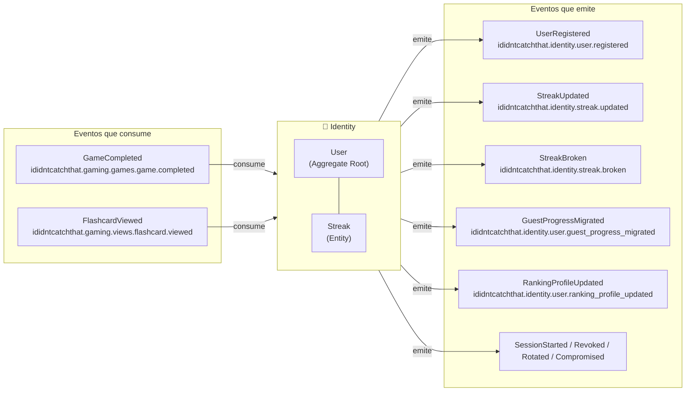
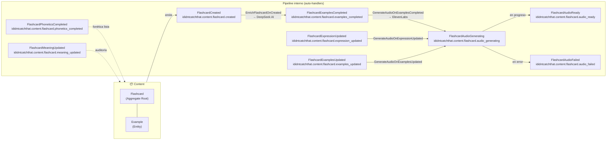
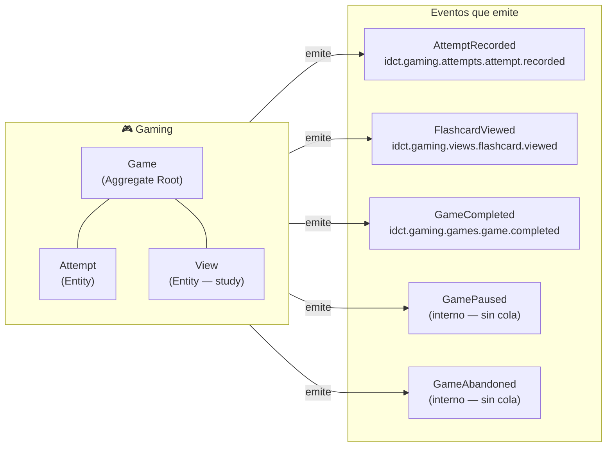
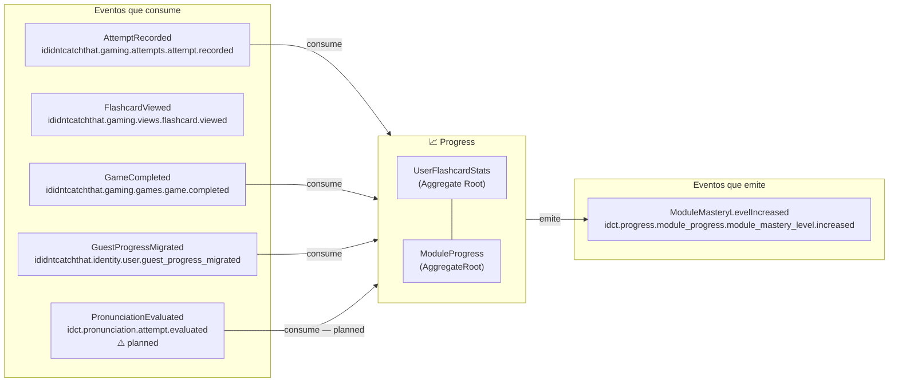
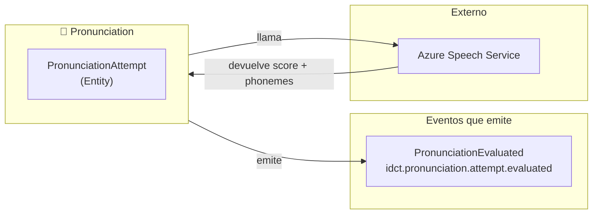
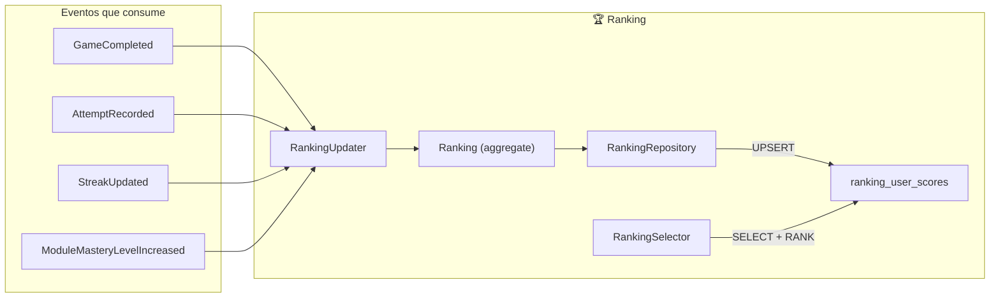
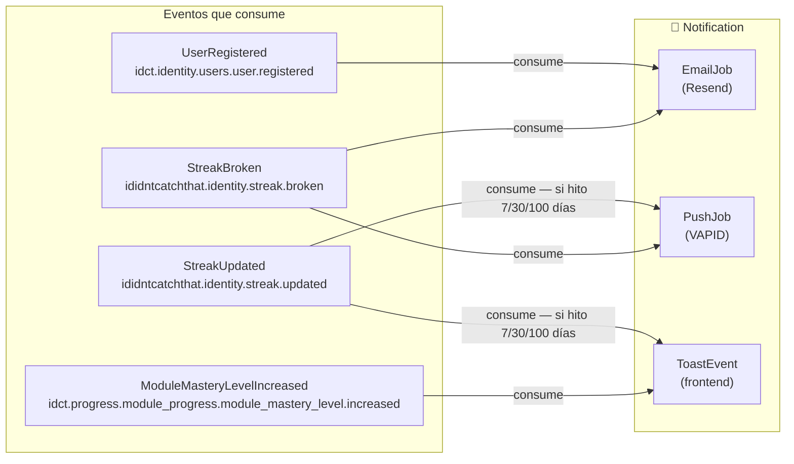

# Bounded Contexts — Detalle por contexto

Eventos que emite y consume cada bounded context, con sus aggregates internos y responsabilidades.

---

## 🔐 Identity

**Responsabilidad**: Gestionar la identidad del usuario, autenticación y racha de actividad.

| Evento emitido | Exchange | Trigger |
|----------------|----------|---------|
| `UserRegistered` | `ididntcatchthat.identity.user.registered` | Usuario completa registro (email o OAuth) |
| `StreakUpdated` | `ididntcatchthat.identity.streak.updated` | `GameCompleted` o `FlashcardViewed` — primera actividad del día |
| `StreakBroken` | `ididntcatchthat.identity.streak.broken` | Job nocturno detecta que `last_activity_date < ayer` |
| `GuestProgressMigrated` | `ididntcatchthat.identity.user.guest_progress_migrated` | Usuario autenticado migra progreso guest |
| `RankingProfileUpdated` | `ididntcatchthat.identity.user.ranking_profile_updated` | PATCH ranking profile |
| `SessionStarted` | `ididntcatchthat.identity.session.started` | Login, register, OAuth, guest |
| `SessionRevoked` | `ididntcatchthat.identity.session.revoked` | Logout |
| `SessionRotated` | `ididntcatchthat.identity.session.rotated` | Refresh token |
| `SessionCompromised` | `ididntcatchthat.identity.session.compromised` | Reuse detection |

| Evento consumido | Exchange | Acción |
|-----------------|----------|--------|
| `GameCompleted` | `ididntcatchthat.gaming.games.game.completed` | Evalúa si incrementar streak (una vez por día) |
| `FlashcardViewed` | `ididntcatchthat.gaming.views.flashcard.viewed` | Incrementa streak en study si `userId` presente |

---

## 📦 Content

**Responsabilidad**: Gestionar el catálogo de flashcards y el pipeline de generación de audio e IA.

| Evento emitido | Exchange | Trigger |
|----------------|----------|---------|
| `FlashcardCreated` | `ididntcatchthat.content.flashcard.created` | Teacher publica nueva flashcard (manual, bulk JSON o PDF) |
| `FlashcardExamplesCompleted` | `ididntcatchthat.content.flashcard.examples_completed` | AI completa los examples de la flashcard |
| `FlashcardPhoneticsCompleted` | `ididntcatchthat.content.flashcard.phonetics_completed` | AI completa IPA notation y native speech |
| `FlashcardExpressionUpdated` | `ididntcatchthat.content.flashcard.expression_updated` | Teacher edita el campo `expression` |
| `FlashcardExamplesUpdated` | `ididntcatchthat.content.flashcard.examples_updated` | Teacher edita los examples |
| `FlashcardMeaningUpdated` | `ididntcatchthat.content.flashcard.meaning_updated` | Teacher edita el campo `meaning` |
| `FlashcardAudioGenerating` | `ididntcatchthat.content.flashcard.audio_generating` | ElevenLabs call iniciada |
| `FlashcardAudioReady` | `ididntcatchthat.content.flashcard.audio_ready` | Audio subido al CDN con éxito |
| `FlashcardAudioFailed` | `ididntcatchthat.content.flashcard.audio_failed` | ElevenLabs devuelve error |

| Evento consumido (handlers internos) | Exchange | Acción |
|--------------------------------------|----------|--------|
| `FlashcardCreated` | `ididntcatchthat.content.flashcard.created` | `EnrichFlashcardOnFlashcardCreated` → DeepSeek genera examples + phonetics |
| `FlashcardExamplesCompleted` | `ididntcatchthat.content.flashcard.examples_completed` | `GenerateFlashcardAudioOnExamplesCompleted` → ElevenLabs × 4 archivos |
| `FlashcardExpressionUpdated` | `ididntcatchthat.content.flashcard.expression_updated` | `GenerateFlashcardAudioOnExpressionUpdated` → regenera audio |
| `FlashcardExamplesUpdated` | `ididntcatchthat.content.flashcard.examples_updated` | `GenerateFlashcardAudioOnExamplesUpdated` → regenera audio |

---

## 🎮 Gaming

**Responsabilidad**: Gestionar el ciclo de vida de los juegos y registrar los intentos del usuario.

| Evento emitido | Exchange | Trigger |
|----------------|----------|---------|
| `AttemptRecorded` | `idct.gaming.attempts.attempt.recorded` | Usuario responde una flashcard (✓ o ✗) en modo juego — inmediato |
| `FlashcardViewed` | `idct.gaming.views.flashcard.viewed` | Usuario marca flashcard como vista en modo estudio — inmediato |
| `GameCompleted` | `idct.gaming.games.game.completed` | Usuario termina todas las flashcards del game |
| `GamePaused` | — interno | Usuario sale de la pantalla / inactividad > 15 min / acción explícita |
| `GameAbandoned` | — interno | Usuario elige abandonar explícitamente / FIFO al superar 5 pausados |

> `GamePaused` y `GameAbandoned` son eventos de dominio internos — no se publican al bus ya que ningún otro BC los consume.

---

## 📈 Progress

**Responsabilidad**: Materializar y mantener el progreso del usuario por flashcard y por módulo.

| Evento consumido | Exchange | Acción |
|-----------------|----------|--------|
| `AttemptRecorded` | `ididntcatchthat.gaming.attempts.attempt.recorded` | Busca o crea `UserFlashcardStats` → `recordPlay()` (modo juego) |
| `FlashcardViewed` | `ididntcatchthat.gaming.views.flashcard.viewed` | Busca o crea `UserFlashcardStats` → `recordStudy()` |
| `GameCompleted` | `ididntcatchthat.gaming.games.game.completed` | Agrega stats del módulo → recalcula `ModuleProgress` (mastery 0–3) |
| `GuestProgressMigrated` | `ididntcatchthat.identity.user.guest_progress_migrated` | Bulk UPSERT `user_flashcard_stats` desde historial guest (idempotente via inbox) |
| `PronunciationEvaluated` | `idct.pronunciation.attempt.evaluated` | ⚠️ Planned — actualiza pronunciation stats en `user_flashcard_stats` |

| Evento emitido | Exchange | Trigger |
|----------------|----------|---------|
| `ModuleMasteryLevelIncreased` | `idct.progress.module_progress.module_mastery_level.increased` | `masteryLevel` sube al recalcular `ModuleProgress` |

---

## 🎤 Pronunciation ⚠️ Planned

> **No implementado.** BC diseñado y documentado. Pendiente de integrar Azure Speech Service. Los eventos que emite están definidos en el diseño pero no existen en código.

**Responsabilidad**: Evaluar la pronunciación del usuario y emitir el resultado.

| Evento emitido | Exchange | Trigger |
|----------------|----------|---------|
| `PronunciationEvaluated` | `idct.pronunciation.attempt.evaluated` | Azure devuelve resultado → se persiste `PronunciationAttempt` |

---

## 🏆 Ranking

**Responsabilidad**: Mantener la proyección `ranking_user_scores` para lectura eficiente de tablas de clasificación.

| Evento consumido | Exchange | Acción |
|-----------------|----------|--------|
| `GameCompleted` | `ididntcatchthat.gaming.games.game.completed` | `most_active` +1 / recount ventanas |
| `AttemptRecorded` | `ididntcatchthat.gaming.attempts.attempt.recorded` | `top_scorer` +1 si acierto; `most_accurate` recalculado |
| `StreakUpdated` | `ididntcatchthat.identity.streak.updated` | `best_streak` = racha actual |
| `ModuleMasteryLevelIncreased` | `idct.progress.module_progress.module_mastery_level.increased` | `module_master` = nivel del módulo |

**No emite eventos.** Es un pure consumer — la lectura es `SELECT` sobre la proyección.

Write-time usa queries scoped al usuario (o incrementos) — no hay recomputo global ni job cron.

---

## 🔔 Notification ⚠️ Planned

> **No implementado.** BC diseñado y documentado. Los eventos que debería consumir se emiten correctamente desde Identity, Progress y Achievement — solo falta crear los subscribers. Pendiente de integrar Resend (email) y VAPID (push).

**Responsabilidad**: Enviar notificaciones al usuario por los canales disponibles (toast, push, email).

| Evento consumido | Exchange | Canal | Condición |
|-----------------|----------|-------|-----------|
| `UserRegistered` | `idct.identity.users.user.registered` | Email (Resend) | Siempre |
| `StreakUpdated` | `ididntcatchthat.identity.streak.updated` | Toast + Push | Solo si hito (7, 30, 100 días) |
| `StreakBroken` | `ididntcatchthat.identity.streak.broken` | Email + Push | Siempre que streak > 0 |
| `ModuleMasteryLevelIncreased` | `idct.progress.module_progress.module_mastery_level.increased` | Toast | Siempre |

**No emite eventos.** Es un pure consumer — solo ejecuta side effects.
