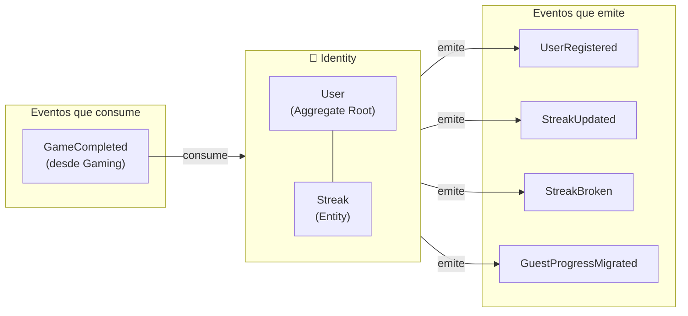
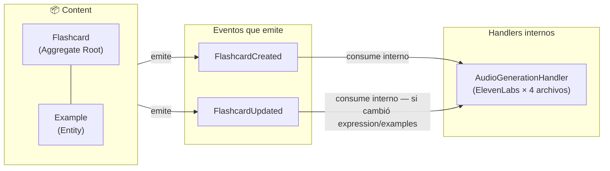
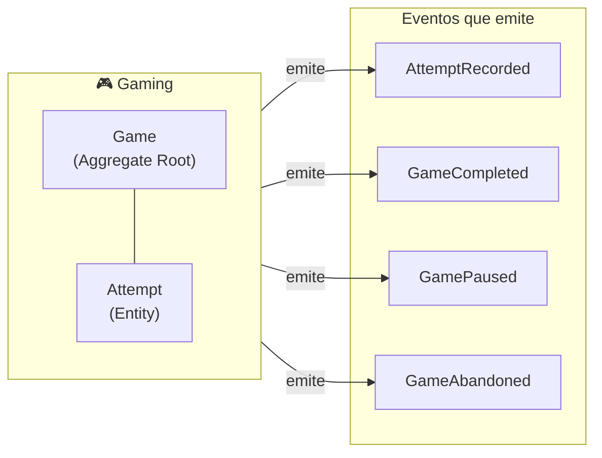
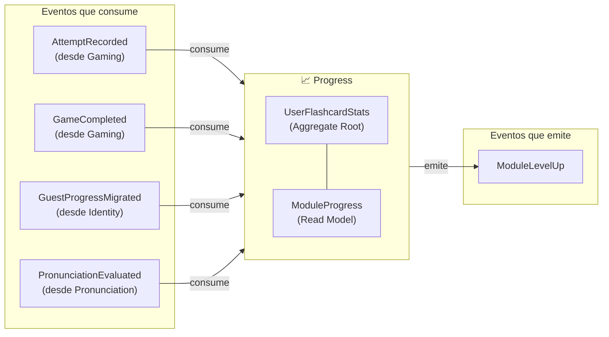
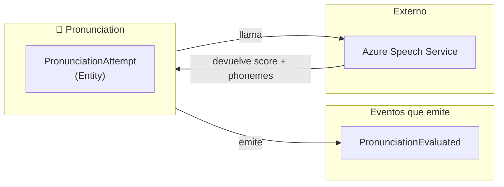
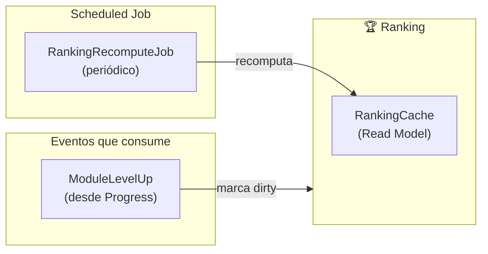
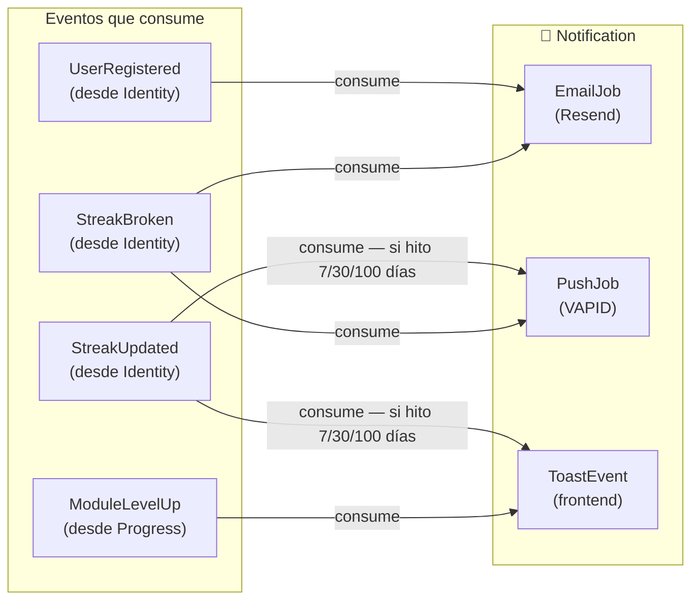

# Bounded Contexts — Detalle por contexto

Eventos que emite y consume cada bounded context, con sus aggregates internos y responsabilidades.

---

## 🔐 Identity

**Responsabilidad**: Gestionar la identidad del usuario, autenticación y racha de actividad.

| Evento emitido          | Trigger                                               |
| ----------------------- | ----------------------------------------------------- |
| `UserRegistered`        | Usuario completa registro (email o OAuth)             |
| `StreakUpdated`         | `GameCompleted` o sesión de estudio — primera del día |
| `StreakBroken`          | Job nocturno detecta que `last_activity_date < ayer`  |
| `GuestProgressMigrated` | Guest completa registro y envía estado Zustand        |

| Evento consumido | Acción                                         |
| ---------------- | ---------------------------------------------- |
| `GameCompleted`  | Evalúa si incrementar streak (una vez por día) |

---

## 📦 Content

**Responsabilidad**: Gestionar el catálogo de flashcards y el pipeline de generación de audio.

| Evento emitido     | Trigger                                                   |
| ------------------ | --------------------------------------------------------- |
| `FlashcardCreated` | Teacher publica nueva flashcard (manual, bulk JSON o PDF) |
| `FlashcardUpdated` | Teacher edita una flashcard existente                     |

| Evento consumido   | Acción                                                            |
| ------------------ | ----------------------------------------------------------------- |
| `FlashcardCreated` | AudioGenerationHandler → ElevenLabs → CDN → `audio_status: ready` |
| `FlashcardUpdated` | AudioGenerationHandler (solo si cambió `expression` o `examples`) |

---

## 🎮 Gaming

**Responsabilidad**: Gestionar el ciclo de vida de los juegos y registrar los intentos del usuario.

| Evento emitido    | Trigger                                                               |
| ----------------- | --------------------------------------------------------------------- |
| `AttemptRecorded` | Usuario responde una flashcard (✓ o ✗) — inmediato                    |
| `GameCompleted`   | Usuario termina todas las flashcards del game                         |
| `GamePaused`      | Usuario sale de la pantalla / inactividad > 15 min / acción explícita |
| `GameAbandoned`   | Usuario elige abandonar explícitamente / FIFO al superar 5 pausados   |

---

## 📈 Progress

**Responsabilidad**: Materializar y mantener el progreso del usuario por flashcard y por módulo.

| Evento consumido         | Acción                                                                                     |
| ------------------------ | ------------------------------------------------------------------------------------------ |
| `AttemptRecorded`        | UPSERT `user_flashcard_stats` — actualiza `times_played`, `correct_count`, `accuracy_rate` |
| `GameCompleted`          | Recalcula `ModuleProgress` (study/mastery/combined level)                                  |
| `GuestProgressMigrated`  | Bulk UPSERT `user_flashcard_stats` desde historial guest                                   |
| `PronunciationEvaluated` | Actualiza pronunciation stats en `user_flashcard_stats`                                    |

| Evento emitido  | Trigger                                               |
| --------------- | ----------------------------------------------------- |
| `ModuleLevelUp` | Recálculo de `ModuleProgress` detecta subida de nivel |

---

## 🎤 Pronunciation

**Responsabilidad**: Evaluar la pronunciación del usuario y emitir el resultado.

| Evento emitido           | Trigger                                                       |
| ------------------------ | ------------------------------------------------------------- |
| `PronunciationEvaluated` | Azure devuelve resultado → se persiste `PronunciationAttempt` |

---

## 🏆 Ranking

**Responsabilidad**: Mantener rankings materializados para lectura eficiente.

| Evento consumido | Acción                                                                          |
| ---------------- | ------------------------------------------------------------------------------- |
| `ModuleLevelUp`  | Marca ranking correspondiente como `dirty` → será recomputado en el próximo job |

**No emite eventos.** Es un pure read model — solo responde a queries.

Fuentes de datos para el cálculo:

- `user_flashcard_stats` → accuracy, flashcards acertadas, module level
- `games` → partidas jugadas
- `users` → streak actual

---

## 🔔 Notification

**Responsabilidad**: Enviar notificaciones al usuario por los canales disponibles (toast, push, email).

| Evento consumido | Canal          | Condición                      |
| ---------------- | -------------- | ------------------------------ |
| `UserRegistered` | Email (Resend) | Siempre                        |
| `StreakUpdated`  | Toast + Push   | Solo si hito (7, 30, 100 días) |
| `StreakBroken`   | Email + Push   | Siempre que streak > 0         |
| `ModuleLevelUp`  | Toast          | Siempre                        |

**No emite eventos.** Es un pure consumer — solo ejecuta side effects.
