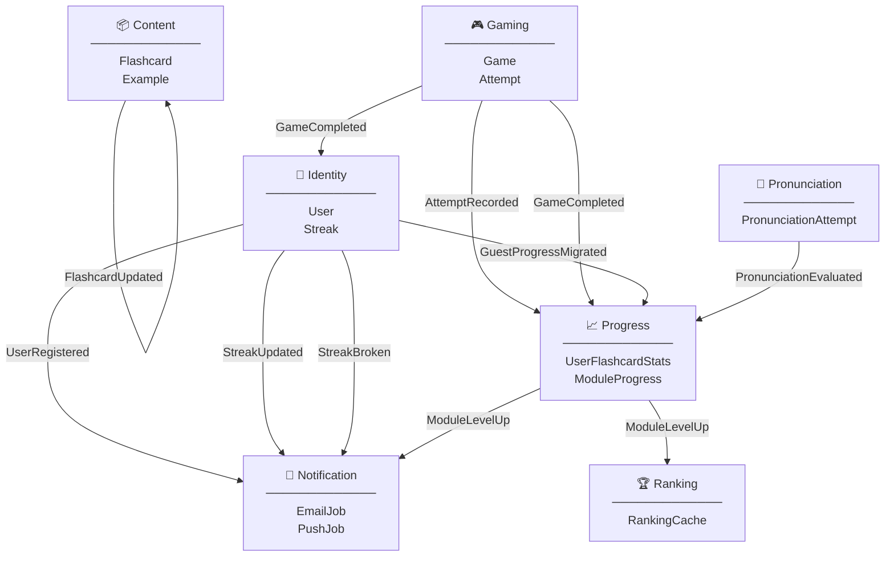

# Bounded Contexts — Vista general

Mapa de los bounded contexts de **ididntcatchthat** y los eventos de dominio que fluyen entre ellos.

---

## Bounded Contexts

---

## Flujo de eventos — tabla resumen

| Evento | Exchange | Emitido por | Consumido por | Efecto |
|--------|----------|-------------|---------------|--------|
| `FlashcardCreated` | `idct.content.flashcard.created` | Content | Content (interno) | Trigger audio pipeline async (×4 archivos) |
| `FlashcardUpdated` | `idct.content.flashcard.updated` | Content | Content (interno) | Regenera audio si cambió `expression` o `examples` |
| `AttemptRecorded` | `idct.gaming.attempts.attempt.recorded` | Gaming | Progress | Actualiza `user_flashcard_stats` en write-time |
| `GameCompleted` | `idct.gaming.games.game.completed` | Gaming | Progress | Recalcula `ModuleProgress` (study/mastery/combined level) |
| `GameCompleted` | `idct.gaming.games.game.completed` | Gaming | Identity | Incrementa streak si no se incrementó hoy |
| `UserRegistered` | `idct.identity.users.user.registered` | Identity | Notification | Envía email de bienvenida (Resend) |
| `StreakUpdated` | `idct.identity.streaks.streak.updated` | Identity | Notification | Toast + push si hito (7, 30, 100 días) |
| `StreakBroken` | `idct.identity.streaks.streak.broken` | Identity | Notification | Email + push notification |
| `GuestProgressMigrated` | `idct.identity.users.guest_progress.migrated` | Identity | Progress | Importa games + attempts del guest → `user_flashcard_stats` |
| `ModuleLevelUp` | `idct.progress.module_progress.module_level.up` | Progress | Notification | Toast de logro en app |
| `ModuleLevelUp` | `idct.progress.module_progress.module_level.up` | Progress | Ranking | Marca ranking como dirty → recomputa en próximo job |
| `PronunciationEvaluated` | `idct.pronunciation.attempt.evaluated` | Pronunciation | Progress | Actualiza pronunciation stats en `user_flashcard_stats` |

---

## Dirección de dependencias

- **Ranking** es un **pure read model** — solo lee de Progress y Gaming, nunca emite eventos.
- **Content** se autogestiona el audio — sus eventos son internos al propio BC.
- **Notification** es un **pure consumer** — nunca emite eventos de dominio, solo ejecuta side effects (email, push, toast).
- **Progress** es el **hub central** — recibe de Gaming, Pronunciation e Identity, y alimenta a Ranking y Notification.
