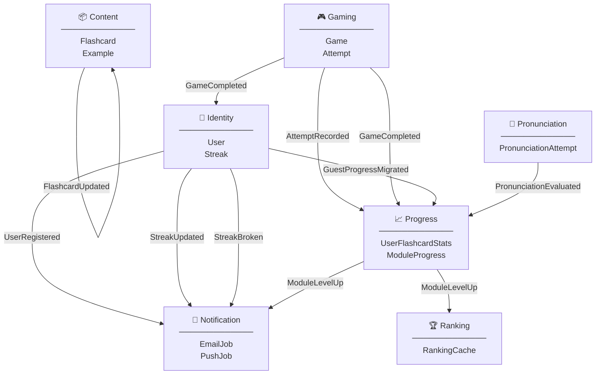

# Bounded Contexts — Vista general

Mapa de los bounded contexts de **ididntcatchthat** y los eventos de dominio que fluyen entre ellos.

---

## Bounded Contexts

---

## Flujo de eventos — tabla resumen

| Evento                   | Emitido por   | Consumido por     | Efecto                                                      |
| ------------------------ | ------------- | ----------------- | ----------------------------------------------------------- |
| `FlashcardCreated`       | Content       | Content (interno) | Trigger audio pipeline async (×4 archivos)                  |
| `FlashcardUpdated`       | Content       | Content (interno) | Regenera audio si cambió `expression` o `examples`          |
| `AttemptRecorded`        | Gaming        | Progress          | Actualiza `user_flashcard_stats` en write-time              |
| `GameCompleted`          | Gaming        | Progress          | Recalcula `ModuleProgress` (study/mastery/combined level)   |
| `GameCompleted`          | Gaming        | Identity          | Incrementa streak si no se incrementó hoy                   |
| `UserRegistered`         | Identity      | Notification      | Envía email de bienvenida (Resend)                          |
| `StreakUpdated`          | Identity      | Notification      | Toast + push si hito (7, 30, 100 días)                      |
| `StreakBroken`           | Identity      | Notification      | Email + push notification                                   |
| `GuestProgressMigrated`  | Identity      | Progress          | Importa games + attempts del guest → `user_flashcard_stats` |
| `ModuleLevelUp`          | Progress      | Notification      | Toast de logro en app                                       |
| `ModuleLevelUp`          | Progress      | Ranking           | Marca ranking como dirty → recomputa en próximo job         |
| `PronunciationEvaluated` | Pronunciation | Progress          | Actualiza pronunciation stats en `user_flashcard_stats`     |

---

## Dirección de dependencias

- **Ranking** es un **pure read model** — solo lee de Progress y Gaming, nunca emite eventos.
- **Content** se autogestiona el audio — sus eventos son internos al propio BC.
- **Notification** es un **pure consumer** — nunca emite eventos de dominio, solo ejecuta side effects (email, push, toast).
- **Progress** es el **hub central** — recibe de Gaming, Pronunciation e Identity, y alimenta a Ranking y Notification.
