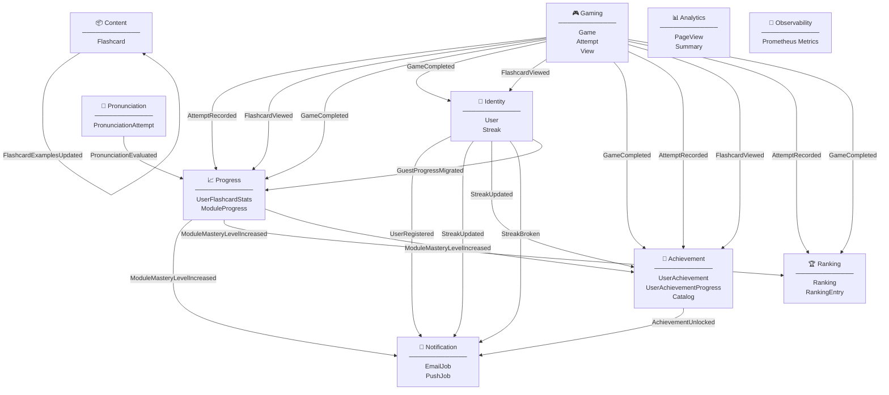

# Bounded Contexts — Vista general

Mapa de los bounded contexts de **ididntcatchthat** y los eventos de dominio que fluyen entre ellos.

---

## Bounded Contexts

---

## Flujo de eventos — tabla resumen

| Evento | Exchange | Emitido por | Consumido por | Efecto |
|--------|----------|-------------|---------------|--------|
| `FlashcardCreated` | `ididntcatchthat.content.flashcard.created` | Content | Content (interno) | Enriquecimiento AI secuencial (examples + phonetics) |
| `FlashcardExamplesCompleted` | `ididntcatchthat.content.flashcard.examples_completed` | Content | Content (interno) | Genera audio tras alta |
| `FlashcardExpressionUpdated` | `ididntcatchthat.content.flashcard.expression_updated` | Content | Content (interno) | Regenera audio tras editar expression |
| `FlashcardExamplesUpdated` | `ididntcatchthat.content.flashcard.examples_updated` | Content | Content (interno) | Regenera audio tras editar examples |
| `AttemptRecorded` | `ididntcatchthat.gaming.attempts.attempt.recorded` | Gaming | Progress | Actualiza `user_flashcard_stats`; en partidas random recalcula `ModuleProgress` por módulo de flashcard |
| `FlashcardViewed` | `ididntcatchthat.gaming.views.flashcard.viewed` | Gaming | Progress | Incrementa `times_studied` en modo study (event-driven async) |
| `AttemptRecorded` | `ididntcatchthat.gaming.attempts.attempt.recorded` | Gaming | Ranking | Actualiza `most_accurate` y `top_scorer` vía aggregate `Ranking` |
| `AttemptRecorded` | `ididntcatchthat.gaming.attempts.attempt.recorded` | Gaming | Achievement | Incrementa `total_played_attempts` en `user_achievement_progress` |
| `FlashcardViewed` | `ididntcatchthat.gaming.views.flashcard.viewed` | Gaming | Achievement | Registra módulo tocado en `user_achievement_progress` |
| `GameCompleted` | `ididntcatchthat.gaming.games.game.completed` | Gaming | Progress | Recalcula `ModuleProgress` (módulo fijo o batch en random) |
| `GameCompleted` | `ididntcatchthat.gaming.games.game.completed` | Gaming | Identity | Incrementa streak si no se incrementó hoy |
| `FlashcardViewed` | `ididntcatchthat.gaming.views.flashcard.viewed` | Gaming | Identity | Incrementa streak en modo study (primera actividad del día) |
| `GameCompleted` | `ididntcatchthat.gaming.games.game.completed` | Gaming | Achievement | Evalúa y desbloquea logros (game/study) |
| `GameCompleted` | `ididntcatchthat.gaming.games.game.completed` | Gaming | Ranking | Actualiza `most_active` vía aggregate `Ranking` |
| `AchievementUnlocked` | `ididntcatchthat.achievement.user_achievement.unlocked` | Achievement | Notification (futuro) | Toast in-app vía cliente poll; push/email pendiente |
| `UserRegistered` | `ididntcatchthat.identity.user.registered` | Identity | Notification | Envía email de bienvenida (Resend) |
| `StreakUpdated` | `ididntcatchthat.identity.streak.updated` | Identity | Notification | Toast + push si hito (7, 30, 100 días) |
| `StreakUpdated` | `ididntcatchthat.identity.streak.updated` | Identity | Achievement | Desbloquea logros streak_7/30/100 |
| `StreakUpdated` | `ididntcatchthat.identity.streak.updated` | Identity | Ranking | Actualiza `best_streak` vía aggregate `Ranking` |
| `StreakBroken` | `ididntcatchthat.identity.streak.broken` | Identity | Notification | Email + push notification |
| `RankingProfileUpdated` | `ididntcatchthat.identity.user.ranking_profile_updated` | Identity | Ranking | Sincroniza opt-in/out y nickname en tablas de ranking |
| `GuestProgressMigrated` | `ididntcatchthat.identity.user.guest_progress_migrated` | Identity | Gaming | Reasigna `games.user_id` de guest → usuario registrado |
| `GuestProgressMigrated` | `ididntcatchthat.identity.user.guest_progress_migrated` | Identity | Progress | Importa attempts de games migrados → `user_flashcard_stats` |
| `SessionStarted` | `ididntcatchthat.identity.session.started` | Identity | — | Observabilidad / futuros consumidores |
| `SessionRevoked` | `ididntcatchthat.identity.session.revoked` | Identity | — | Logout |
| `SessionRotated` | `ididntcatchthat.identity.session.rotated` | Identity | — | Refresh token |
| `SessionCompromised` | `ididntcatchthat.identity.session.compromised` | Identity | — | Reuse detection |
| `ModuleMasteryLevelIncreased` | `idct.progress.module_progress.module_mastery_level.increased` | Progress | Notification | Toast de logro en app |
| `ModuleMasteryLevelIncreased` | `idct.progress.module_progress.module_mastery_level.increased` | Progress | Achievement | Desbloquea module_mastery_2/3 |
| `ModuleMasteryLevelIncreased` | `idct.progress.module_progress.module_mastery_level.increased` | Progress | Ranking | Actualiza `module_master` vía aggregate `Ranking` |
| `PronunciationEvaluated` | `idct.pronunciation.attempt.evaluated` | Pronunciation | Progress | Actualiza pronunciation stats en `user_flashcard_stats` |

---

## Dirección de dependencias

- **Analytics** es un BC **sin eventos** — escribe `page_views` y lee tablas de otros BCs vía SQL para el read model `summary`. No emite ni consume domain events.
- **Observability** expone métricas Prometheus de runtime (`GET /v1/metrics/summary`) — separado de Analytics (histórico persistente).
- **Content** se autogestiona el audio — sus eventos son internos al propio BC.
- **Notification** es un **pure consumer** — nunca emite eventos de dominio, solo ejecuta side effects (email, push, toast).
- **Progress** es el **hub central** — recibe de Gaming, Pronunciation e Identity, y alimenta a Ranking y Notification.
- **`ModuleMasteryLevelIncreased`** dispara notificaciones y actualiza el ranking de maestros del módulo vía aggregate `Ranking`.
