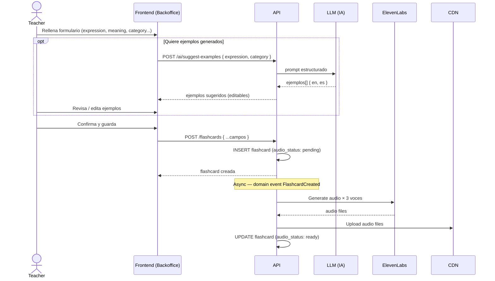
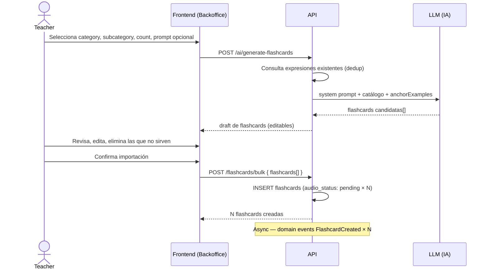

# Content & Backoffice — Definición conceptual

Documento de referencia para el diseño del dominio de contenido y la gestión del backoffice.

---

## Roles con acceso al backoffice

| Rol         | Acceso                                                                    |
| ----------- | ------------------------------------------------------------------------- |
| **Teacher** | Crear, editar y publicar flashcards                                       |
| **Admin**   | Todo lo anterior + métricas, observabilidad, Swagger, gestión de usuarios |

> **Premium/Pro**: rol reservado para futuro, sin implementar en el TFM. Incluido en el modelo de datos para evitar migraciones posteriores.

---

## Estructura de una Flashcard

| Campo            | Tipo           | Quién lo rellena | Descripción |
| ---------------- | -------------- | ---------------- | ----------- |
| `expression`     | string         | Teacher          | La expresión, palabra o construcción en inglés |
| `meaning`        | string         | Teacher          | Significado en castellano |
| `category`       | enum           | Teacher          | Módulo al que pertenece |
| `subcategory`    | enum (cerrado) | Teacher          | Subtipo dentro del módulo |
| `ipa_notation`   | string         | IA (editable)    | Transcripción fonética estándar — ej. `ˈrɛd ən ɡriːn` |
| `native_speech`  | string         | IA (editable)    | Cómo lo pronuncia un nativo — ej. `"rehran green"` |
| `examples`       | array (1-3)    | IA (editable)    | Ejemplos de uso — cada uno con `{ en, es }` |
| `audio_status`   | enum           | Sistema          | `pending` · `generating` · `ready` · `failed` |

### Audio por flashcard

| Campo | Acentos | Nº archivos |
|-------|---------|-------------|
| `expression_audio` | US · UK · AU | 3 |
| `examples_audio` | US only | 1 (todos los ejemplos concatenados con pausa) |

**Total: 4 archivos de audio por flashcard.**

Los campos `ipa_notation`, `native_speech` y `examples` se generan automáticamente con IA (DeepSeek u otro LLM económico) para **todas las categorías** sin excepción. El teacher puede editarlos o sobreescribirlos antes de publicar.

### Categorías y subcategorías

Las subcategorías son un **catálogo cerrado predefinido** — no las puede crear el teacher libremente.

| Categoría          | Slug               | Ejemplos de subcategoría                          |
| ------------------ | ------------------ | ------------------------------------------------- |
| Sonidos nativos    | `native_sounds`    | `v_vacation`, `t_soft_between_vowels`, vocales... |
| Habla conectada    | `connected_speech` | `informal_going_to`, `word_linking`...            |
| Fluidez y conectores | `flow_connectors`| `contrast`, `meetings`...                         |
| Inglés de calle    | `real_talk`        | `phrasal_verbs`, `fillers`...                     |

> Catálogo completo: [`content-taxonomy.md`](./content-taxonomy.md)

---

## Formas de crear flashcards

### 1. Formulario manual (individual)

El teacher rellena todos los campos directamente. Los ejemplos pueden generarse con ayuda de IA (ver abajo) y son editables antes de guardar.

### 2. Bulk insert vía JSON

Endpoint que acepta un array de flashcards en el mismo formato del formulario. Útil para importaciones masivas desde hojas de cálculo o herramientas externas.

```json
[
  {
    "expression": "gonna",
    "meaning": "voy a / va a",
    "category": "connected_speech",
    "subcategory": "informal_going_to",
    "examples": [
      { "en": "I'm gonna call you later.", "es": "Te voy a llamar más tarde." },
      { "en": "She's gonna love it.", "es": "Le va a encantar." }
    ]
  }
]
```

### 3. Generación asistida con IA

El teacher selecciona categoría, subcategoría, cantidad (5–20) y opcionalmente un prompt extra. Un LLM (DeepSeek en prod, stub en local) genera borradores evitando duplicar expresiones ya existentes en la subcategoría:

- Expresión en inglés
- Significado en castellano
- Categoría y subcategoría (fijadas por el request)
- Ejemplos de uso (1–3, en inglés + traducción)

El resultado se muestra como flashcards **editables** antes de confirmar. El teacher revisa, ajusta y publica vía bulk create.

```
Selección category + subcategory + count
    ↓
Consulta expresiones existentes (dedup)
    ↓
LLM genera drafts (system prompt estructurado)
    ↓
Draft de flashcards (editable en UI)
    ↓
Teacher confirma / edita
    ↓
POST /flashcards/bulk + trigger audio pipeline
```

---

## Pipeline de audio (async)

El audio se genera de forma **asíncrona** tras crear la flashcard — no bloquea la UI del teacher.

```
INSERT flashcard (audio_status: pending)
    ↓
Domain Event: FlashcardCreated
    ↓
Audio Handler → ElevenLabs API × 3 voces (US, UK, AU)
    ↓
Archivos subidos a CDN
    ↓
UPDATE flashcard (audio_status: ready, audio_urls: {...})
```

La flashcard es visible para los usuarios desde el momento de creación. Si el audio aún no está listo, el cliente muestra un estado de "cargando audio".

---

## Generación de ejemplos con IA

Cuando el teacher está creando una flashcard de forma manual, puede solicitar que la IA sugiera ejemplos de uso.

- La IA devuelve entre 1 y 3 ejemplos, cada uno con **texto en inglés + traducción al castellano**.
- Los ejemplos son **editables** — el teacher puede modificarlos, eliminarlos o añadir los suyos.
- La generación es opcional — el teacher puede escribir los ejemplos sin IA.

---

## Flujo de publicación

No hay estados intermedios (draft/published). **Todo lo que se crea va directo a producción.**

Si el teacher quiere corregir algo, edita la flashcard existente.

---

## Diagramas de secuencia

### Creación de flashcard vía formulario



### Generación masiva vía IA


