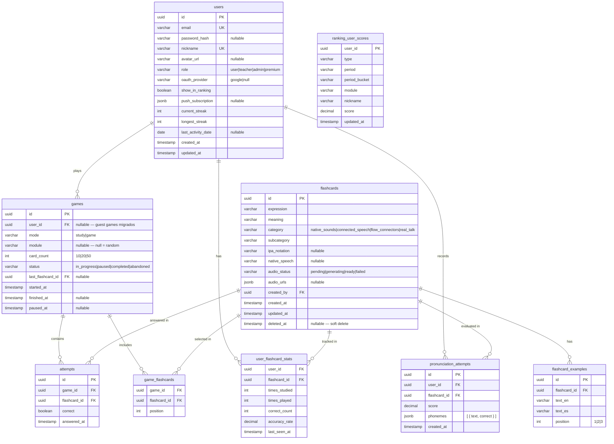

# Database Schema — ididntcatchthat

Esquema relacional derivado del modelo de dominio. PostgreSQL.

---

## Diagrama ER



---

## Notas por tabla

### `users`

- `role` es un único valor — un usuario tiene un rol principal. Si en el futuro se necesitan roles múltiples, se extrae a `user_roles[]`.
- `password_hash` es null para usuarios OAuth.
- `push_subscription` guarda el objeto completo de la Web Push API (endpoint + keys).
- `premium` en `role` está reservado — no tiene lógica implementada en MVP.

### `flashcards`

- `audio_urls` es jsonb con estructura `{ expression: { us, uk, au }, examples: { us } }`.
- `created_by` referencia al teacher o admin que la creó.
- `deleted_at` nullable — soft delete desde backoffice; la fila se conserva para partidas/stats existentes.

### `flashcard_examples`

- Separada de `flashcards` para normalización.
- `position` garantiza el orden de presentación (1, 2, 3).
- El audio de ejemplos (concatenado, solo US) se almacena en `flashcards.audio_urls.examples.us`.

### `games`

- `user_id` es nullable para soportar la migración de partidas guest — se rellena en `MigrateGuestProgressUseCase`.
- `last_flashcard_id` apunta a la última flashcard mostrada — permite retomar desde ahí.
- `module` es null cuando el juego es en modo random.

### `game_flashcards`

- Tabla intermedia N:M entre games y flashcards.
- `position` define el orden en que se presentan las cartas.

### `attempts`

- Cada fila = una respuesta del usuario a una flashcard en un game.
- Se persisten en tiempo real (no al final del game).
- Al INSERT un attempt → trigger/handler actualiza `user_flashcard_stats`.

### `user_flashcard_stats`

- PK compuesta: `(user_id, flashcard_id)`.
- `accuracy_rate` = `correct_count / times_played` — calculado en write-time.
- `times_studied` se incrementa en modo estudio, `times_played` en modo juego.

### `pronunciation_attempts`

- `phonemes` es jsonb: `[{ "text": "Red", "correct": true }, { "text": "and", "correct": false }]`.
- `score` es 0-100 (Azure Speech devuelve este rango).

### `ranking_user_scores`

- Tabla de persistencia del aggregate `Ranking` — una fila por `(user_id, type, period, period_bucket, module)`.
- Se actualiza en write-time vía `RankingUpdater` → `RankingRepository.save()`.
- El **rank** (posición) no se almacena; se calcula en lectura con `RANK() OVER (ORDER BY score DESC)`.
- `period_bucket`: `all` para all_time, `rolling` para ventanas móviles weekly/monthly.
- `module` es `global` para rankings globales; nombre de módulo para `module_master`.
- Solo existen filas de usuarios con `show_in_ranking = true` (o que lo activaron y tienen backfill).

---

## Índices relevantes

```sql
-- Búsqueda de games pausados por usuario
CREATE INDEX idx_games_user_status ON games(user_id, status);

-- Stats por usuario (lectura frecuente)
CREATE INDEX idx_ufs_user ON user_flashcard_stats(user_id);

-- Stats por flashcard (para rankings y progreso)
CREATE INDEX idx_ufs_flashcard ON user_flashcard_stats(flashcard_id);

-- Attempts por game (retoma de partida)
CREATE INDEX idx_attempts_game ON attempts(game_id);

-- Leaderboard por tipo + período (lectura GET /rankings)
CREATE INDEX idx_ranking_user_scores_leaderboard
  ON ranking_user_scores(type, period, period_bucket, module, score DESC);

-- Posición del usuario fuera del top N
CREATE INDEX idx_ranking_user_scores_user_lookup
  ON ranking_user_scores(type, period, period_bucket, module, user_id);

-- Flashcards por categoría (selección de cartas para un game)
CREATE INDEX idx_flashcards_category ON flashcards(category, subcategory);

-- Pronunciación por usuario
CREATE INDEX idx_pronunciation_user ON pronunciation_attempts(user_id, flashcard_id);
```

---

## Constraints de integridad clave

```sql
-- Máximo 5 games pausados por usuario
-- (enforced en dominio, no en DB — demasiado complejo como constraint nativo)

-- accuracy_rate siempre entre 0 y 1
ALTER TABLE user_flashcard_stats
  ADD CONSTRAINT chk_accuracy CHECK (accuracy_rate >= 0 AND accuracy_rate <= 1);

-- card_count solo valores válidos
ALTER TABLE games
  ADD CONSTRAINT chk_card_count CHECK (card_count IN (10, 20, 50));

-- position de ejemplos entre 1 y 3
ALTER TABLE flashcard_examples
  ADD CONSTRAINT chk_position CHECK (position BETWEEN 1 AND 3);

-- score de pronunciación entre 0 y 100
ALTER TABLE pronunciation_attempts
  ADD CONSTRAINT chk_score CHECK (score >= 0 AND score <= 100);
```
