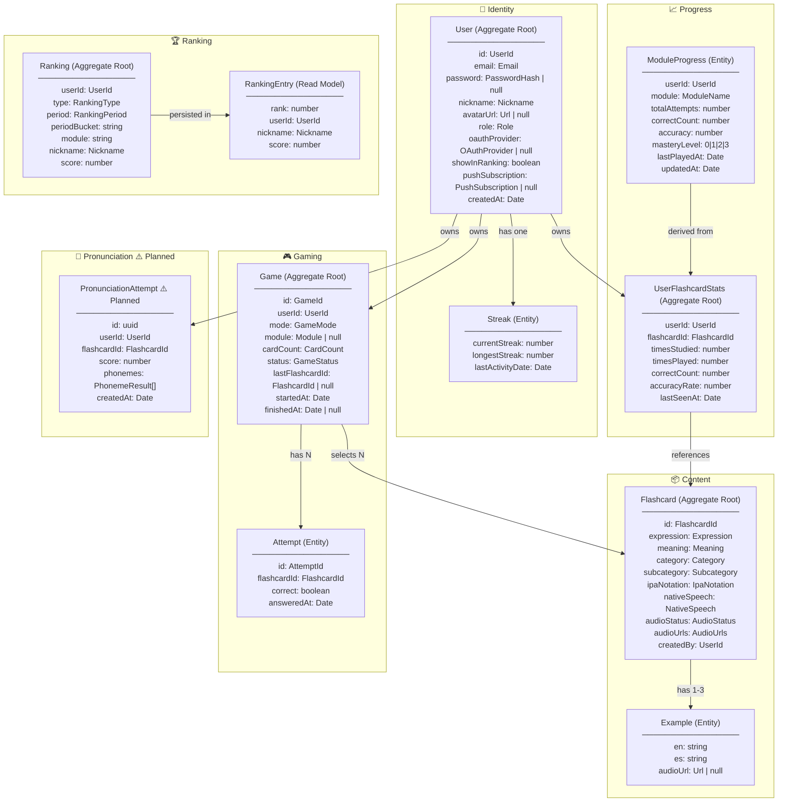

# Domain Model — Aggregates, Entidades y Relaciones

Diagrama de dominio de **ididntcatchthat**. Refleja el modelo conceptual — no es el esquema de base de datos (ese está en `db-schema.md`).

---

## Aggregates y bounded contexts

---

## Value Objects por Aggregate

### Identity

| Value Object    | Validación                                           |
| --------------- | ---------------------------------------------------- |
| `Email`         | formato válido, lowercase                            |
| `PasswordHash`  | bcrypt hash, nunca expuesto                          |
| `Nickname`      | 3-20 chars, alfanumérico + guiones                   |
| `Role`          | enum: `guest \| user \| teacher \| admin \| premium` |
| `OAuthProvider` | enum: `google \| null`                               |

### Content

| Value Object   | Validación                                                                            |
| -------------- | ------------------------------------------------------------------------------------- |
| `Expression`   | non-empty string                                                                      |
| `Meaning`      | non-empty string                                                                      |
| `Category`     | enum: `native_sounds \| connected_speech \| flow_connectors \| real_talk` |
| `Subcategory`  | enum cerrado por categoría                                                            |
| `IpaNotation`  | string, generado por IA                                                               |
| `NativeSpeech` | string, generado por IA                                                               |
| `AudioStatus`  | enum: `pending \| generating \| ready \| failed`                                      |
| `AudioUrls`    | `{ expression: {us, uk, au}, examples: {us} }`                                        |

### Gaming

| Value Object | Validación                                              |
| ------------ | ------------------------------------------------------- |
| `GameMode`   | enum: `study \| game`                                   |
| `Module`     | enum: categorías + `random`                             |
| `CardCount`  | enum: `10 \| 20 \| 50`                                  |
| `GameStatus` | enum: `in_progress \| paused \| completed \| abandoned` |

---

## Domain Events

| Evento                   | Aggregate            | Consecuencia                                   |
| ------------------------ | -------------------- | ---------------------------------------------- |
| `FlashcardCreated`       | Flashcard            | → genera audio (async)                         |
| `FlashcardUpdated`       | Flashcard            | → regenera audio si cambió expression/examples |
| `AttemptRecorded`        | Game                 | → actualiza `UserFlashcardStats` (write-time)  |
| `GameCompleted`          | Game                 | → actualiza streak + ModuleProgress            |
| `GamePaused`             | Game                 | → persiste `lastFlashcardId`                   |
| `GameAbandoned`          | Game                 | → libera slot de pausados                      |
| `UserRegistered`         | User                 | → email bienvenida (Resend)                    |
| `GuestProgressMigrated`  | User                 | → importa games + attempts del guest           |
| `StreakUpdated`          | User                 | → notificación si hito (7, 30, 100 días)       |
| `StreakBroken`           | User                 | → email + push notification                    |
| `PronunciationEvaluated` ⚠️ | PronunciationAttempt ⚠️ Planned | → actualiza pronunciation stats (BC no implementado) |

---

## Reglas de dominio clave

1. **Un Game no puede tener más de `cardCount` Attempts.**
2. **Un User no puede tener más de 5 Games en estado `paused` simultáneamente.**
3. **Un Guest no puede pausar un Game** — el modo pausa es exclusivo de usuarios registrados.
4. **Un Guest solo puede jugar 3 partidas de máximo 10 cartas por día.**
5. **`accuracy_rate` solo se calcula desde Attempts de Games en modo `game`**, nunca desde modo `study`.
6. **El Streak se incrementa una vez por día** — múltiples sesiones en el mismo día no lo incrementan más de una vez.
7. **`show_in_ranking` es opt-in** — un User nunca aparece en rankings sin haberlo activado explícitamente.
8. **Las flashcards se publican directamente** — no hay estado draft.
9. **Los Examples del retry final no generan Attempts** — son frontend-only.
10. **`AudioUrls.expression` requiere los 3 acentos (us, uk, au). `AudioUrls.examples` solo us.**
