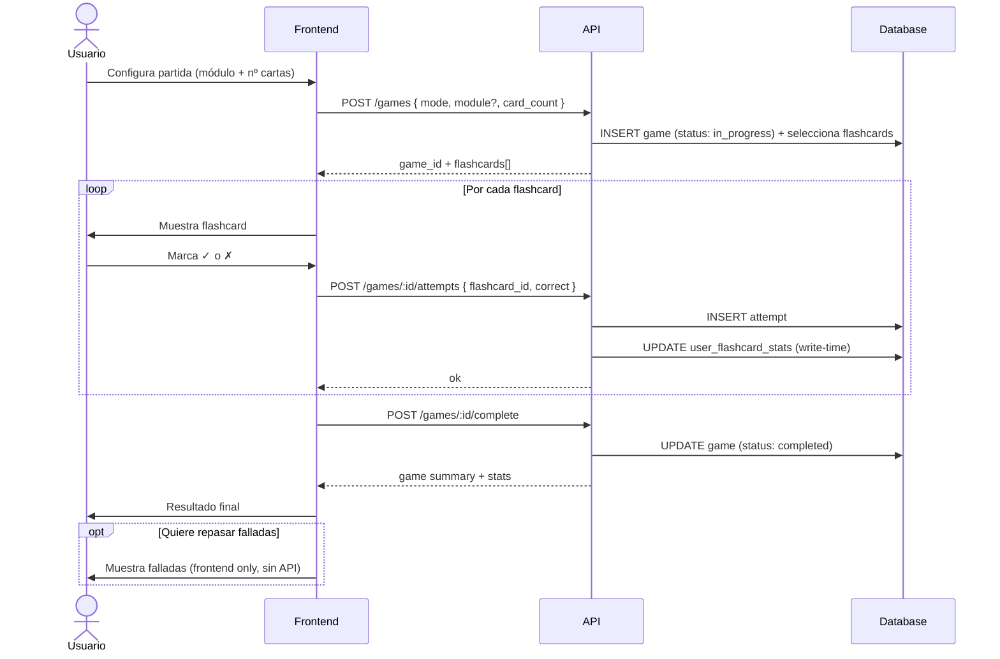
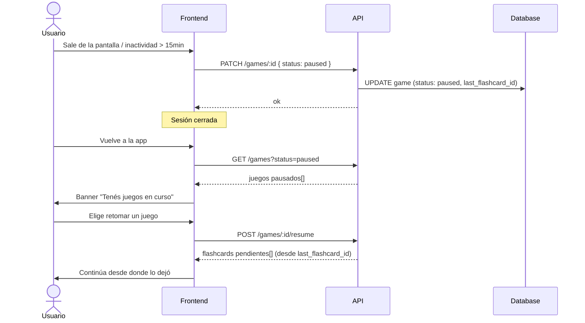
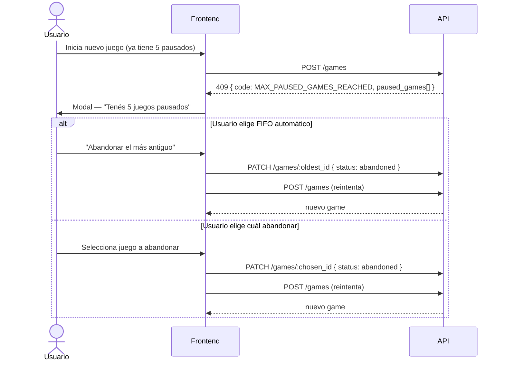

# Game Mechanics — Definición conceptual

Documento de referencia para el diseño del dominio del juego. Recoge las decisiones tomadas antes de la implementación.

---

## Modos de juego

La app tiene **dos modos separados** con propósitos distintos:

| Modo        | Propósito                      | Afecta streak | Afecta stats / accuracy |
| ----------- | ------------------------------ | :-----------: | :---------------------: |
| **Estudio** | Repasar contenido sin presión  |      ✅       |           ❌            |
| **Juego**   | Evaluar conocimiento, competir |      ✅       |           ✅            |

El streak se activa con **cualquier actividad** (estudio o juego) — refleja hábito diario, no rendimiento.

---

## Configuración de una sesión

Antes de empezar, el usuario configura:

| Parámetro              | Opciones                                                    |
| ---------------------- | ----------------------------------------------------------- |
| Selección de contenido | Random (todos los módulos mezclados) o un módulo específico |
| Cantidad de flashcards | 10 · 20 · 50                                                |

### Módulos disponibles

| Módulo                     | Descripción                                                  |
| -------------------------- | ------------------------------------------------------------ |
| Native Sounds              | Los 23 fonemas del inglés                                    |
| Connecting Words in Speech | Connected speech — cómo cambian los sonidos al unir palabras |
| Beautifying Sentences      | Conectores y estructuras para sonar más fluido               |
| Sounding Native            | Expresiones coloquiales de uso real                          |

---

## Ciclo de vida de un Game

```
            ┌─────────────┐
            │  in_progress │
            └──────┬──────┘
                   │
         ┌─────────┴──────────┐
         ▼                    ▼
    ┌─────────┐         ┌───────────┐
    │ paused  │         │ completed │
    └────┬────┘         └───────────┘
         │
    ┌────┴──────────────┐
    │  retoma o abandona │
    └────┬──────────────┘
         │
    ┌────▼────┐
    │abandoned│  ← solo por acción explícita del usuario
    └─────────┘
```

### Reglas

- **Auto-pause**: al salir de la pantalla del juego (visibility change / beforeunload) o si pasan más de 10-15 min entre un attempt y el siguiente.
- **Abandoned**: únicamente si el usuario pulsa "abandonar partida" explícitamente.
- **Pausa / retoma**: solo disponible para usuarios registrados. Los guests no pueden pausar (no hay sesión persistente).
- **Máximo de juegos pausados simultáneos**: **5**.
  - Al intentar iniciar un juego nuevo con 5 pausados, la app avisa y ofrece:
    - Abandonar el más antiguo (FIFO automático)
    - Elegir cuál abandonar manualmente
- **Retomar**: la app muestra una notificación/banner cuando hay juegos pausados. También accesible desde el historial de partidas. El usuario elige cuál retomar.
- **Al retomar**: se muestra la última flashcard donde se quedó como primera carta. Las ya respondidas no se vuelven a mostrar (están persistidas como attempts).

---

## Attempts — persistencia en tiempo real

Cada respuesta del usuario a una flashcard es un **Attempt** que se persiste **inmediatamente** (no al final del juego).

### Por qué en tiempo real

- Permite pausar y retomar con precisión (sabemos exactamente cuál fue la última carta).
- Cada attempt escrito dispara la actualización de `user_flashcard_stats` en el momento — sin necesidad de agregaciones costosas al final.

### Relación Game → Attempt

```
Game (1) ──── (N) Attempt
Game (N) ──── (N) Flashcard   ← las flashcards seleccionadas para ese game
```

---

## Estadísticas — write-time materialization

El patrón elegido es **actualizar los agregados en el momento de escritura** de cada attempt, no calcularlos a posteriori.

### `user_flashcard_stats` — tabla central

| Campo           | Alimentado por | Descripción                        |
| --------------- | -------------- | ---------------------------------- |
| `user_id`       | —              | Propietario                        |
| `flashcard_id`  | —              | Flashcard referenciada             |
| `times_studied` | Modo estudio   | Veces que la vio en estudio        |
| `times_played`  | Modo juego     | Veces que la respondió en juego    |
| `correct_count` | Modo juego     | Respuestas correctas               |
| `accuracy_rate` | Modo juego     | `correct_count / times_played`     |
| `last_seen_at`  | Ambos modos    | Última vez que interactuó con ella |

De esta tabla se derivan sin queries adicionales:

- **Flashcards débiles**: las de `accuracy_rate` más bajo — base para el futuro "repasa tus peores".
- **Progreso por módulo**: % de flashcards del módulo con `times_studied > 0`.
- **Niveles por módulo** (ver abajo).

---

## Niveles por módulo

Cada módulo expone **tres métricas de nivel independientes**:

| Nivel              | Basado en                | Significado            |
| ------------------ | ------------------------ | ---------------------- |
| **Study level**    | `times_studied`          | Has visto el contenido |
| **Mastery level**  | `accuracy_rate` en juego | Demostrás que lo sabés |
| **Combined level** | Study + Mastery juntos   | Lo viste Y lo dominás  |

Los umbrales exactos (ej. nivel 1 = viste todas las cartas una vez, nivel 2 = 3 veces, nivel 3 = accuracy > 70%) se definirán en el diseño técnico.

---

## Retry de flashcards falladas

Al terminar un juego, el usuario puede repasar las flashcards que falló.

- Es una funcionalidad **frontend only** — sin persistencia en base de datos.
- No genera attempts, no afecta stats, no afecta accuracy.
- Razón: la proximidad temporal entre fallo y reintento hace que los aciertos no sean representativos del aprendizaje real.

---

## Modo estudio — tracking

El modo estudio usa el mismo aggregate `Game` con `mode: study`, pero registra **views** (no attempts con evaluación):

- **Streak** del usuario (día activo) — vía `GameCompletedEvent` al completar la sesión.
- **`user_flashcard_stats.times_studied`** y `last_seen_at` por cada carta vista — vía `FlashcardViewedEvent`.

No genera `Attempt` ni afecta `accuracy_rate`. El historial de estudio se deriva de `user_flashcard_stats` (last_seen_at, times_studied por módulo).

> Decisión arquitectónica: [ADR-027](../adr/027-study-mode-architecture.md)

---

## Diagramas de secuencia

### Flujo completo de una partida (modo juego)



### Flujo de pausa y retoma



### Flujo al superar el límite de juegos pausados


