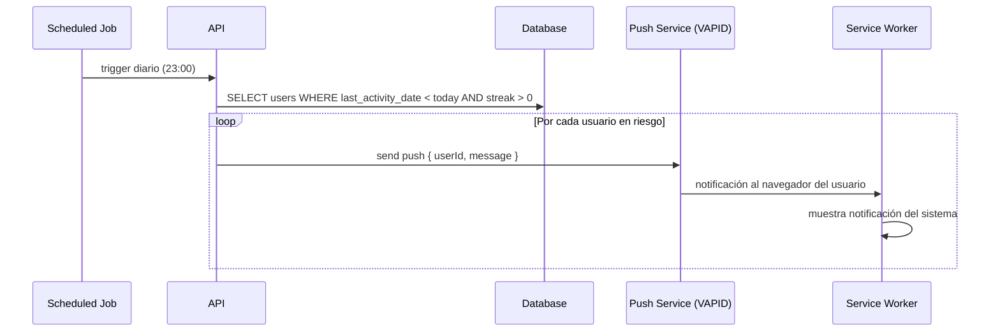

# Notification — Definición conceptual

---

## Scope

Las notificaciones son **exclusivas para usuarios registrados** (User, Teacher, Admin). Los guests no reciben notificaciones.

---

## Canales implementados en MVP

### 1. Toast (in-app)

Notificaciones visuales dentro de la SPA mientras el usuario está activo.

| Trigger                            | Mensaje                                          |
| ---------------------------------- | ------------------------------------------------ |
| Racha conseguida (7, 30, 100 días) | "🔥 ¡7 días de racha! Seguí así"                 |
| Módulo completado                  | "✅ Completaste Native Sounds nivel 1"           |
| Logro desbloqueado                 | "🏆 Nuevo logro: First Blood"                    |
| Límite guest alcanzado             | "Registrate para seguir jugando"                 |
| Game pausado automáticamente       | "Partida pausada — podés retomar cuando quieras" |

Implementación: Zustand store de notificaciones + componente Toast global.

### 2. Push Notifications (Service Worker)

Notificaciones del navegador — funcionan aunque el usuario no esté en la app.

Requiere:

- Service Worker registrado
- VAPID keys (generadas en backend)
- Opt-in explícito del usuario (el browser pide permiso)

| Trigger                             | Mensaje                                     |
| ----------------------------------- | ------------------------------------------- |
| Racha en riesgo (no jugó en el día) | "Tu racha de N días peligra — jugá 5 min"   |
| Inactividad > 3 días                | "Te echamos de menos — seguí con tu inglés" |

### 3. Email transaccional (Resend)

Emails puntuales, sin saturar. Solo eventos importantes.

| Trigger                      | Email                                      |
| ---------------------------- | ------------------------------------------ |
| Registro                     | Bienvenida + tips para empezar             |
| Racha rota                   | "Se rompió tu racha de N días — volvé hoy" |
| Hito de racha (30, 100 días) | Felicitación + badge                       |
| Inactividad > 7 días         | Recordatorio suave                         |

Proveedor: **Resend** (tier gratuito generoso, API simple, buena reputación de entrega).

---

## Newsletter con tips IA — documentado para post-MVP

Sistema de emails periódicos con contenido generado por IA personalizado al perfil del usuario.

```
Job diario/semanal
    ↓
Para cada suscriptor activo:
  → Analiza sus flashcards más débiles (accuracy_rate más bajo)
  → LLM genera tip personalizado sobre ese fonema/expresión
  → Resend envía el email
```

**No se implementa en el TFM** — documentado para la fase post-entrega.

Requiere:

- Opt-in explícito a newsletter (campo en perfil)
- Pipeline de generación IA + plantilla de email
- Gestión de bajas (unsubscribe)

---

## Diagrama de secuencia — push notification de racha en riesgo


