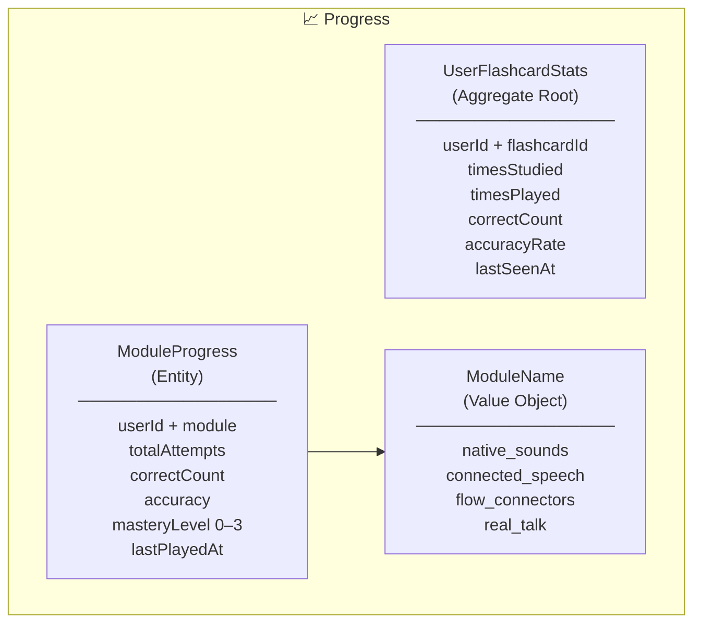
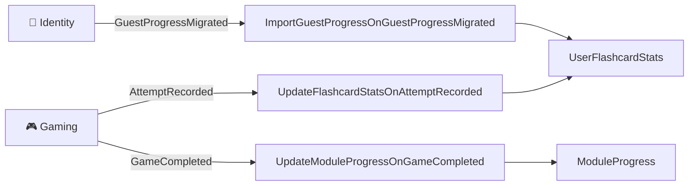

# Progress — Bounded Context

> Materializa el aprendizaje del usuario a partir de los eventos emitidos por Gaming e Identity.
> No genera datos propios — consume, agrega y expone.

---

## Responsabilidad

El BC Progress es el **hub de estadísticas del usuario**. No tiene lógica de juego propia: reacciona a hechos que ocurrieron en otros contextos y construye una vista coherente del progreso del usuario.

Tres responsabilidades concretas:

1. **Estadísticas por flashcard** — cuántas veces se estudió/jugó cada flashcard, cuántas correctas, tasa de acierto.
2. **Progreso por módulo** — agrega las estadísticas de flashcards de un módulo y computa un `masteryLevel` (0–3).
3. **Migración de progreso guest** — cuando un usuario anónimo se registra, importa todos sus intentos previos.

---

## Modelo de dominio



### `UserFlashcardStats` — Aggregate Root

Estadísticas de una flashcard concreta para un usuario concreto. PK compuesta `(userId, flashcardId)`.

| Campo          | Tipo          | Descripción                        |
| -------------- | ------------- | ---------------------------------- |
| `userId`       | `UserId`      | FK al usuario                      |
| `flashcardId`  | `FlashcardId` | FK a la flashcard                  |
| `timesStudied` | `number`      | Veces vista en modo estudio        |
| `timesPlayed`  | `number`      | Veces jugada en modo juego         |
| `correctCount` | `number`      | Respuestas correctas totales       |
| `accuracyRate` | `number`      | `correctCount / timesPlayed` (0–1) |
| `lastSeenAt`   | `Date`        | Última vez que se interactuó       |

**Métodos de dominio:**

- `create(userId, flashcardId)` — inicializa todos los contadores en 0
- `recordStudy(correct)` — incrementa `timesStudied`, y `correctCount` si fue correcta
- `recordPlay(correct)` — incrementa `timesPlayed`, recalcula `accuracyRate`

---

### `ModuleProgress` — Entity

Progreso agregado de un usuario en un módulo temático. PK compuesta `(userId, module)`.

| Campo           | Tipo         | Descripción                    |
| --------------- | ------------ | ------------------------------ |
| `userId`        | `UserId`     | FK al usuario                  |
| `module`        | `ModuleName` | Módulo temático                |
| `totalAttempts` | `number`     | Suma de intentos en el módulo  |
| `correctCount`  | `number`     | Suma de respuestas correctas   |
| `accuracy`      | `number`     | `correctCount / totalAttempts` |
| `masteryLevel`  | `number`     | 0–3 (ver reglas abajo)         |
| `lastPlayedAt`  | `Date`       | Último juego en este módulo    |

**Reglas de `masteryLevel`:**

| Level | Condición                                   |
| ----- | ------------------------------------------- |
| 3     | `totalAttempts >= 20` && `accuracy >= 0.85` |
| 2     | `totalAttempts >= 10` && `accuracy >= 0.70` |
| 1     | `totalAttempts >= 5` && `accuracy >= 0.50`  |
| 0     | No cumple ninguna                           |

---

### `ModuleName` — Value Object

Enum de módulos válidos del sistema. Falla en construcción si el valor no pertenece al conjunto.

```
native_sounds | connected_speech | flow_connectors | real_talk
```

---

## Domain Events

### Emitido por Progress

| Evento                        | Exchange                                                       | Trigger                                            |
| ----------------------------- | -------------------------------------------------------------- | -------------------------------------------------- |
| `ModuleMasteryLevelIncreased` | `idct.progress.module_progress.module_mastery_level.increased` | `masteryLevel` sube al recalcular `ModuleProgress` |

**Atributos de `ModuleMasteryLevelIncreased`:**

| Campo           | Tipo     |
| --------------- | -------- |
| `userId`        | `string` |
| `module`        | `string` |
| `previousLevel` | `number` |
| `newLevel`      | `number` |
| `occurredAt`    | `string` |

---

### Consumidos por Progress



| Evento consumido        | Origen   | Acción                                                     |
| ----------------------- | -------- | ---------------------------------------------------------- |
| `AttemptRecorded`       | Gaming   | Actualiza `UserFlashcardStats`; si partida random (`game.module` null) y `mode=game`, recalcula `ModuleProgress` del módulo de la flashcard |
| `GameCompleted`         | Gaming   | Recalcula `ModuleProgress` del módulo jugado; si random (`module` null), recalcula todos los módulos tocados en la partida |
| `GuestProgressMigrated` | Identity | Importa todos los intentos del guest al usuario registrado |

> **Nota:** `AttemptRecorded` se ignora si `userId === null` (intentos de guests no se materializan en tiempo real — se importan al registrarse).  
> **Nota:** En partidas random (`games.module IS NULL`), cada `AttemptRecorded` en modo juego recalcula el `ModuleProgress` del módulo de la flashcard. Al completar la partida random, se recalculan todos los módulos tocados como red de seguridad.

---

## Casos de uso

### Comandos (escritura)

| Use Case               | Trigger                 | Descripción                                                               |
| ---------------------- | ----------------------- | ------------------------------------------------------------------------- |
| `UpdateFlashcardStats` | `AttemptRecorded`       | Busca o crea `UserFlashcardStats`, registra el intento; orquesta recálculo random vía `RandomModuleProgressUpdater` |
| `UpdateModuleProgress` | `GameCompleted`         | Agrega stats del módulo (o módulos tocados si random), recalcula mastery, emite evento si sube de nivel |
| `ImportGuestProgress`  | `GuestProgressMigrated` | Idempotente (inbox pattern). Importa todos los intentos del guest         |

### Queries (lectura)

| Use Case                   | Endpoint                                   | Descripción                                                                  |
| -------------------------- | ------------------------------------------ | ---------------------------------------------------------------------------- |
| `ModuleProgressFinder`     | `GET /progress/modules`                    | Todos los módulos con progreso del usuario, ordenado por `masteryLevel` DESC |
| `WeakestFlashcardSearcher` | `GET /progress/flashcards/weakest?limit=N` | Flashcards con menor `accuracyRate`. Limit 1–50, default 10                  |

---

## API REST

| Método | Ruta                           | Auth | Descripción                                         |
| ------ | ------------------------------ | ---- | --------------------------------------------------- |
| `GET`  | `/progress/modules`            | JWT  | Progreso por módulo del usuario autenticado         |
| `GET`  | `/progress/flashcards/weakest` | JWT  | Flashcards más débiles del usuario (menor accuracy) |

---

## Persistencia

### Tabla `user_flashcard_stats`

PK compuesta: `(user_id, flashcard_id)`

| Columna         | Tipo           | Default |
| --------------- | -------------- | ------- |
| `user_id`       | `uuid`         | —       |
| `flashcard_id`  | `uuid`         | —       |
| `times_studied` | `int`          | 0       |
| `times_played`  | `int`          | 0       |
| `correct_count` | `int`          | 0       |
| `accuracy_rate` | `decimal(5,4)` | 0       |
| `last_seen_at`  | `timestamp`    | —       |

### Tabla `module_progress`

PK compuesta: `(user_id, module)`

| Columna          | Tipo           | Default |
| ---------------- | -------------- | ------- |
| `user_id`        | `uuid`         | —       |
| `module`         | `varchar(100)` | —       |
| `total_attempts` | `int`          | 0       |
| `correct_count`  | `int`          | 0       |
| `accuracy`       | `decimal(5,4)` | 0       |
| `mastery_level`  | `smallint`     | 0       |
| `last_played_at` | `timestamp`    | —       |
| `updated_at`     | `timestamp`    | —       |

> Progress también usa la tabla `processed_events` (definida en Shared) para garantizar idempotencia en `ImportGuestProgress`.

---

## Flujo completo — usuario juega una partida

```
1. Usuario completa una partida en Gaming
        ↓
2. Gaming emite AttemptRecorded (×N intentos)
   Gaming emite GameCompleted (×1)
        ↓
3. Progress recibe cada AttemptRecorded
   → UpdateFlashcardStats: upsert en user_flashcard_stats
        ↓
4. Progress recibe GameCompleted
   → UpdateModuleProgress:
       a. Agrega user_flashcard_stats del módulo via JOIN con flashcards.category
       b. Recalcula accuracy y masteryLevel
       c. Upsert en module_progress
       d. Si masteryLevel subió → emite ModuleMasteryLevelIncreased
```

---

## Flujo completo — guest se registra

```
1. Guest completa N partidas (sin userId — registradas como intentos anónimos)
        ↓
2. Guest se registra → Identity emite GuestProgressMigrated
        ↓
3. Progress recibe GuestProgressMigrated
   → ImportGuestProgress (idempotente):
       a. Verifica que el eventId no fue ya procesado
       b. Lee todos los intentos del guestDeviceId en la tabla attempts/games
       c. Para cada intento: upsert en user_flashcard_stats con el nuevo userId
       d. Marca eventId como procesado en processed_events
```
