# RabbitMQ Design — Exchanges, Colas, Retry y DLQ

Diseño completo de la mensajería asíncrona de **ididntcatchthat**. Basado en [ADR 019](../adr/019-event-bus-strategy.md).

---

## Naming convention

```
<proyecto>.<bc>.<subcontexts?>.<aggregate>.<actioninpast>
```

| Regla                  | Valor                                                  |
| ---------------------- | ------------------------------------------------------ |
| Proyecto               | `idct` (acrónimo de ididntcatchthat)                   |
| BCs                    | **singular** (estilo DDD — nombre del dominio)         |
| Subcontextos / módulos | **plural** (opcional — solo si el BC tiene submódulos) |
| Aggregate              | **singular**                                           |
| Acción                 | verbo en pasado                                        |

| BC              | ¿Tiene subcontexto? | Ejemplo                                         |
| --------------- | :-----------------: | ----------------------------------------------- |
| `content`       |         ❌          | `idct.content.flashcard.created`                |
| `gaming`        |         ✅          | `idct.gaming.games.game.completed`              |
| `identity`      |         ✅          | `idct.identity.users.user.registered`           |
| `progress`      |         ✅          | `idct.progress.module_progress.module_level.up` |
| `pronunciation` |         ❌          | `idct.pronunciation.attempt.evaluated`          |

---

## Resumen de todos los eventos y sus handlers

| Exchange                                        | BC Emisor     | BC Consumidor | Handler                                                 |
| ----------------------------------------------- | ------------- | ------------- | ------------------------------------------------------- |
| `idct.content.flashcard.created`                | Content       | Content       | `create_flashcard_audio_on_flashcard_created`           |
| `idct.content.flashcard.updated`                | Content       | Content       | `regenerate_flashcard_audio_on_flashcard_updated`       |
| `idct.gaming.attempts.attempt.recorded`         | Gaming        | Progress      | `update_flashcard_stats_on_attempt_recorded`            |
| `idct.gaming.games.game.completed`              | Gaming        | Progress      | `update_module_progress_on_game_completed`              |
| `idct.gaming.games.game.completed`              | Gaming        | Identity      | `update_streak_on_game_completed`                       |
| `idct.identity.users.user.registered`           | Identity      | Notification  | `send_welcome_email_on_user_registered`                 |
| `idct.identity.streaks.streak.updated`          | Identity      | Notification  | `notify_streak_milestone_on_streak_updated`             |
| `idct.identity.streaks.streak.broken`           | Identity      | Notification  | `notify_streak_broken_on_streak_broken`                 |
| `idct.identity.users.guest_progress.migrated`   | Identity      | Progress      | `import_guest_progress_on_guest_progress_migrated`      |
| `idct.progress.module_progress.module_mastery_level.increased` | Progress      | Notification  | `notify_level_up_on_module_mastery_level_increased`     |
| `idct.progress.module_progress.module_mastery_level.increased` | Progress      | Ranking       | `update_ranking_on_module_mastery_level_increased`      |
| `ididntcatchthat.gaming.games.game.completed`                  | Gaming        | Achievement   | `unlock_user_achievement_on_game_completed`             |
| `ididntcatchthat.gaming.attempts.attempt.recorded`             | Gaming        | Achievement   | `update_progress_on_attempt_recorded`                 |
| `ididntcatchthat.gaming.views.flashcard.viewed`                | Gaming        | Achievement   | `update_progress_on_flashcard_viewed`                   |
| `idct.identity.streaks.streak.updated`                         | Identity      | Achievement   | `unlock_user_achievement_on_streak_updated`             |
| `idct.progress.module_progress.module_mastery_level.increased` | Progress      | Achievement   | `unlock_user_achievement_on_module_mastery_level_increased` |
| `ididntcatchthat.achievement.user_achievement.unlocked`        | Achievement   | Notification (futuro) | Reservado para toast/push vía Notification BC   |
| `ididntcatchthat.gaming.games.game.completed`                  | Gaming        | Ranking       | `update_ranking_on_game_completed`                      |
| `ididntcatchthat.gaming.attempts.attempt.recorded`             | Gaming        | Ranking       | `update_ranking_on_attempt_recorded`                    |
| `idct.identity.streaks.streak.updated`                         | Identity      | Ranking       | `update_ranking_on_streak_updated`                      |
| `idct.pronunciation.attempt.evaluated`          | Pronunciation | Progress      | `update_pronunciation_stats_on_pronunciation_evaluated` |

> Nota: `idct.gaming.games.game.completed` tiene **dos handlers** suscritos — uno en Progress y otro en Identity. Cada handler tiene su propia cola con binding al mismo exchange.

---

## Exchanges

Un exchange por aggregate + evento. Tipo `topic`, durable.

```
idct.content.flashcard.created
idct.content.flashcard.updated
idct.gaming.attempts.attempt.recorded
idct.gaming.games.game.completed
idct.identity.users.user.registered
idct.identity.streaks.streak.updated
idct.identity.streaks.streak.broken
idct.identity.users.guest_progress.migrated
idct.progress.module_progress.module_level.up
idct.pronunciation.attempt.evaluated
```

---

## Colas completas — main + retry + dead letter

Cada handler registra automáticamente sus 3 colas al arrancar via `setupQueues()`.

### 📦 Content

```
# FlashcardCreated → genera audio
create_flashcard_audio_on_flashcard_created
create_flashcard_audio_on_flashcard_created.retry
create_flashcard_audio_on_flashcard_created.dead_letter

# FlashcardUpdated → regenera audio si cambió expression/examples
regenerate_flashcard_audio_on_flashcard_updated
regenerate_flashcard_audio_on_flashcard_updated.retry
regenerate_flashcard_audio_on_flashcard_updated.dead_letter
```

### 🎮 Gaming → 📈 Progress

```
# AttemptRecorded → UPSERT user_flashcard_stats (write-time)
update_flashcard_stats_on_attempt_recorded
update_flashcard_stats_on_attempt_recorded.retry
update_flashcard_stats_on_attempt_recorded.dead_letter

# GameCompleted → recalcula ModuleProgress
update_module_progress_on_game_completed
update_module_progress_on_game_completed.retry
update_module_progress_on_game_completed.dead_letter
```

### 🎮 Gaming → 🔐 Identity

```
# GameCompleted → evalúa incremento de streak
update_streak_on_game_completed
update_streak_on_game_completed.retry
update_streak_on_game_completed.dead_letter
```

### 🔐 Identity → 🔔 Notification

```
# UserRegistered → email bienvenida (Resend)
send_welcome_email_on_user_registered
send_welcome_email_on_user_registered.retry
send_welcome_email_on_user_registered.dead_letter

# StreakUpdated → toast + push si hito (7/30/100 días)
notify_streak_milestone_on_streak_updated
notify_streak_milestone_on_streak_updated.retry
notify_streak_milestone_on_streak_updated.dead_letter

# StreakBroken → email + push
notify_streak_broken_on_streak_broken
notify_streak_broken_on_streak_broken.retry
notify_streak_broken_on_streak_broken.dead_letter
```

### 🔐 Identity → 📈 Progress

```
# GuestProgressMigrated → bulk UPSERT user_flashcard_stats
import_guest_progress_on_guest_progress_migrated
import_guest_progress_on_guest_progress_migrated.retry
import_guest_progress_on_guest_progress_migrated.dead_letter
```

### 📈 Progress → 🔔 Notification

```
# ModuleLevelUp → toast de logro
notify_level_up_on_module_level_up
notify_level_up_on_module_level_up.retry
notify_level_up_on_module_level_up.dead_letter
```

### 📈 Progress → 🏆 Ranking

```
# ModuleMasteryLevelIncreased → actualiza module_master en proyección
ranking.update_ranking_on_module_mastery_level_increased
ranking.update_ranking_on_module_mastery_level_increased.retry
ranking.update_ranking_on_module_mastery_level_increased.dead_letter
```

### 🎮 Gaming → 🏆 Ranking

```
# GameCompleted → actualiza most_active
ranking.update_ranking_on_game_completed
ranking.update_ranking_on_game_completed.retry
ranking.update_ranking_on_game_completed.dead_letter

# AttemptRecorded → actualiza most_accurate y top_scorer
ranking.update_ranking_on_attempt_recorded
ranking.update_ranking_on_attempt_recorded.retry
ranking.update_ranking_on_attempt_recorded.dead_letter
```

### 👤 Identity → 🏆 Ranking

```
# StreakUpdated → actualiza best_streak
ranking.update_ranking_on_streak_updated
ranking.update_ranking_on_streak_updated.retry
ranking.update_ranking_on_streak_updated.dead_letter
```

### 🎤 Pronunciation → 📈 Progress

```
# PronunciationEvaluated → actualiza pronunciation stats
update_pronunciation_stats_on_pronunciation_evaluated
update_pronunciation_stats_on_pronunciation_evaluated.retry
update_pronunciation_stats_on_pronunciation_evaluated.dead_letter
```

---

## Retry policy

| Intento | Delay | Mecanismo                                                             |
| ------- | ----- | --------------------------------------------------------------------- |
| 1       | 1s    | `expiration: "1000"` en mensaje → `.retry` → vuelve a cola principal  |
| 2       | 5s    | `expiration: "5000"` en mensaje → `.retry` → vuelve a cola principal  |
| 3       | 10s   | `expiration: "10000"` en mensaje → `.retry` → vuelve a cola principal |
| 4       | —     | → `.dead_letter` — no más reintentos automáticos                      |

El TTL es **por mensaje** (header `expiration`), no por cola — permite backoff real con una sola `.retry` queue.

---

## Idempotencia por handler

| Handler                                                 | Estrategia         | Razón                                                |
| ------------------------------------------------------- | ------------------ | ---------------------------------------------------- |
| `create_flashcard_audio_on_flashcard_created`           | Opción A — natural | Audio existe o no — verificable                      |
| `regenerate_flashcard_audio_on_flashcard_updated`       | Opción A — natural | Verificable por `audio_status`                       |
| `update_flashcard_stats_on_attempt_recorded`            | Opción A — natural | UPSERT es idempotente por naturaleza                 |
| `update_module_progress_on_game_completed`              | Opción A — natural | Recálculo es idempotente                             |
| `update_streak_on_game_completed`                       | Opción A — natural | `last_activity_date` evita doble incremento          |
| `send_welcome_email_on_user_registered`                 | Opción A — natural | Resend tiene idempotency key propio                  |
| `notify_streak_milestone_on_streak_updated`             | Opción A — natural | Verificable: ¿ya se notificó este hito?              |
| `notify_streak_broken_on_streak_broken`                 | Opción A — natural | Verificable por fecha                                |
| `import_guest_progress_on_guest_progress_migrated`      | Opción B — Inbox   | Bulk insert con efectos no trivialmente verificables |
| `notify_level_up_on_module_level_up`                    | Opción A — natural | Verificable por nivel actual                         |
| `update_ranking_on_module_mastery_level_increased`      | Opción A — natural | `RankingRepository.save` es idempotente por PK compuesta |
| `update_ranking_on_game_completed`                      | Opción A — natural | Increment / recount scoped al usuario vía aggregate      |
| `update_ranking_on_attempt_recorded`                    | Opción A — natural | `applyScore` / `incrementScore` scoped al usuario        |
| `update_ranking_on_streak_updated`                      | Opción A — natural | `applyScore` idempotente                                 |
| `update_pronunciation_stats_on_pronunciation_evaluated` | Opción A — natural | UPSERT idempotente                                   |

---

## Diagrama de flujo completo

```mermaid
flowchart TD
    subgraph Content ["📦 Content"]
        FC_EX["idct.content.flashcard.created"]
        FU_EX["idct.content.flashcard.updated"]
        FC_Q["create_flashcard_audio\n_on_flashcard_created"]
        FC_R["...retry"]
        FC_D["...dead_letter"]
        FU_Q["regenerate_flashcard_audio\n_on_flashcard_updated"]
        FU_R["...retry"]
        FU_D["...dead_letter"]
        FC_EX --> FC_Q --> FC_R --> FC_Q
        FC_Q -- agota reintentos --> FC_D
        FU_EX --> FU_Q --> FU_R --> FU_Q
        FU_Q -- agota reintentos --> FU_D
    end

    subgraph Gaming_Progress ["🎮 Gaming → 📈 Progress"]
        AR_EX["idct.gaming.attempts.attempt.recorded"]
        GC_EX["idct.gaming.games.game.completed"]
        AR_Q["update_flashcard_stats\n_on_attempt_recorded"]
        AR_R["...retry"]
        AR_D["...dead_letter"]
        MP_Q["update_module_progress\n_on_game_completed"]
        MP_R["...retry"]
        MP_D["...dead_letter"]
        AR_EX --> AR_Q --> AR_R --> AR_Q
        AR_Q -- agota --> AR_D
        GC_EX --> MP_Q --> MP_R --> MP_Q
        MP_Q -- agota --> MP_D
    end

    subgraph Gaming_Identity ["🎮 Gaming → 🔐 Identity"]
        GC_EX2["idct.gaming.games.game.completed"]
        SK_Q["update_streak\n_on_game_completed"]
        SK_R["...retry"]
        SK_D["...dead_letter"]
        GC_EX2 --> SK_Q --> SK_R --> SK_Q
        SK_Q -- agota --> SK_D
    end

    subgraph Identity_Notification ["🔐 Identity → 🔔 Notification"]
        UR_EX["idct.identity.users.user.registered"]
        SU_EX["idct.identity.streaks.streak.updated"]
        SB_EX["idct.identity.streaks.streak.broken"]
        WE_Q["send_welcome_email\n_on_user_registered"]
        WE_R["...retry"]
        WE_D["...dead_letter"]
        SM_Q["notify_streak_milestone\n_on_streak_updated"]
        SM_R["...retry"]
        SM_D["...dead_letter"]
        SBN_Q["notify_streak_broken\n_on_streak_broken"]
        SBN_R["...retry"]
        SBN_D["...dead_letter"]
        UR_EX --> WE_Q --> WE_R --> WE_Q
        WE_Q -- agota --> WE_D
        SU_EX --> SM_Q --> SM_R --> SM_Q
        SM_Q -- agota --> SM_D
        SB_EX --> SBN_Q --> SBN_R --> SBN_Q
        SBN_Q -- agota --> SBN_D
    end

    subgraph Identity_Progress ["🔐 Identity → 📈 Progress"]
        GP_EX["idct.identity.users.guest_progress.migrated"]
        GP_Q["import_guest_progress\n_on_guest_progress_migrated"]
        GP_R["...retry"]
        GP_D["...dead_letter"]
        GP_EX --> GP_Q --> GP_R --> GP_Q
        GP_Q -- agota --> GP_D
    end

    subgraph Progress_Notification ["📈 Progress → 🔔 Notification"]
        ML_EX["idct.progress.module_progress.module_level.up"]
        LU_Q["notify_level_up\n_on_module_level_up"]
        LU_R["...retry"]
        LU_D["...dead_letter"]
        ML_EX --> LU_Q --> LU_R --> LU_Q
        LU_Q -- agota --> LU_D
    end

    subgraph Progress_Ranking ["📈 Progress → 🏆 Ranking"]
        ML_EX2["module_mastery_level.increased"]
        RK_Q["update_ranking_on\n_module_mastery_level_increased"]
        RK_R["...retry"]
        RK_D["...dead_letter"]
        ML_EX2 --> RK_Q --> RK_R --> RK_Q
        RK_Q -- agota --> RK_D
    end

    subgraph Gaming_Ranking ["🎮 Gaming → 🏆 Ranking"]
        GC_EX2["game.completed"]
        AR_EX["attempt.recorded"]
        GC_Q["update_ranking_on_game_completed"]
        AR_Q["update_ranking_on_attempt_recorded"]
        GC_EX2 --> GC_Q
        AR_EX --> AR_Q
    end

    subgraph Identity_Ranking ["👤 Identity → 🏆 Ranking"]
        SU_EX["streak.updated"]
        SU_Q["update_ranking_on_streak_updated"]
        SU_EX --> SU_Q
    end

    subgraph Pronunciation_Progress ["🎤 Pronunciation → 📈 Progress"]
        PE_EX["idct.pronunciation.attempt.evaluated"]
        PS_Q["update_pronunciation_stats\n_on_pronunciation_evaluated"]
        PS_R["...retry"]
        PS_D["...dead_letter"]
        PE_EX --> PS_Q --> PS_R --> PS_Q
        PS_Q -- agota --> PS_D
    end
```



---

## Resumen de colas — total

| #   | Cola principal                                          | Retry | Dead Letter |
| --- | ------------------------------------------------------- | :---: | :---------: |
| 1   | `create_flashcard_audio_on_flashcard_created`           |  ✅   |     ✅      |
| 2   | `regenerate_flashcard_audio_on_flashcard_updated`       |  ✅   |     ✅      |
| 3   | `update_flashcard_stats_on_attempt_recorded`            |  ✅   |     ✅      |
| 4   | `update_module_progress_on_game_completed`              |  ✅   |     ✅      |
| 5   | `update_streak_on_game_completed`                       |  ✅   |     ✅      |
| 6   | `send_welcome_email_on_user_registered`                 |  ✅   |     ✅      |
| 7   | `notify_streak_milestone_on_streak_updated`             |  ✅   |     ✅      |
| 8   | `notify_streak_broken_on_streak_broken`                 |  ✅   |     ✅      |
| 9   | `import_guest_progress_on_guest_progress_migrated`      |  ✅   |     ✅      |
| 10  | `notify_level_up_on_module_mastery_level_increased`     |  ✅   |     ✅      |
| 11  | `update_ranking_on_module_mastery_level_increased`      |  ✅   |     ✅      |
| 12  | `update_ranking_on_game_completed`                      |  ✅   |     ✅      |
| 13  | `update_ranking_on_attempt_recorded`                    |  ✅   |     ✅      |
| 14  | `update_ranking_on_streak_updated`                      |  ✅   |     ✅      |
| 15  | `update_pronunciation_stats_on_pronunciation_evaluated` |  ✅   |     ✅      |

**15 handlers × 3 colas = 45 colas en total.**
