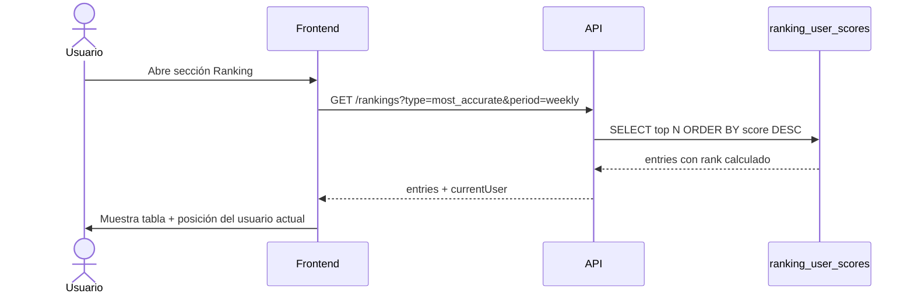
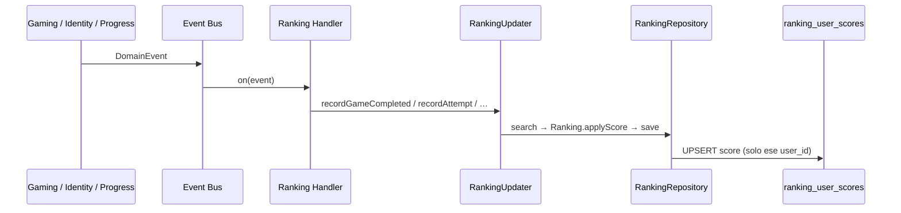

# Ranking — Definición conceptual

---

## Filosofía

El sistema de ranking está diseñado para que **cada tipo de jugador tenga hueco** — no solo el que más juega o el que más acierta. Múltiples rankings especializados garantizan que la gamificación sea inclusiva y motive distintos perfiles de usuario.

---

## Dimensiones del ranking

### Por ámbito

- **Global** — todos los módulos mezclados (`module = global`)
- **Por módulo** — Native Sounds · Connecting Words · Beautifying Sentences · Sounding Native (solo `module_master`)

### Por período

- **Semanal** — ventana móvil de 7 días
- **Mensual** — ventana móvil de 30 días
- **All-time** — histórico completo

`best_streak` y `module_master` solo usan all-time.

### Por métrica (múltiples rankings)

| Ranking       | Métrica                        | A quién favorece     |
| ------------- | ------------------------------ | -------------------- |
| Most Active   | Partidas jugadas               | El jugador constante |
| Most Accurate | Accuracy rate (% aciertos)     | El jugador preciso   |
| Top Scorer    | Flashcards acertadas (volumen) | El jugador prolífico |
| Best Streak   | Racha de días activos          | El jugador habitual  |
| Module Master | Mastery level por módulo       | El especialista      |

---

## Privacidad

- Aparecer en rankings es **opt-in** — por defecto el usuario NO aparece.
- El usuario activa `show_in_ranking` en su perfil y elige un **nickname** público.
- Si desactiva la opción, se eliminan sus filas de `ranking_user_scores` inmediatamente.
- Si activa opt-in, se hace **backfill** de sus scores históricos en la proyección.

---

## Cálculo — proyección incremental

Los rankings **no se recalculan globalmente**. Cada evento actualiza solo las filas del usuario afectado en `ranking_user_scores`:

| Métrica              | Trigger                         | Actualización                          |
| -------------------- | ------------------------------- | -------------------------------------- |
| Partidas jugadas     | `GameCompleted` (mode = game)   | +1 all_time; recount weekly/monthly    |
| Accuracy rate        | `AttemptRecorded` (mode = game) | AVG scoped al usuario en ventana       |
| Flashcards acertadas | `AttemptRecorded` (correct)     | +1 por acierto en modo juego           |
| Streak               | `StreakUpdated`                 | `score = current_streak`               |
| Module mastery       | `ModuleMasteryLevelIncreased`   | `score = mastery_level` del módulo     |

La lectura calcula el rank con `RANK() OVER (ORDER BY score DESC)` sobre la proyección — sin JOIN masivos en `games` ni `user_flashcard_stats`.

---

## Diagrama de secuencia — consulta de ranking

---

## Diagrama de secuencia — actualización por evento

