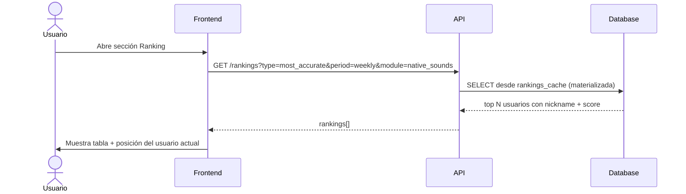

# Ranking — Definición conceptual

---

## Filosofía

El sistema de ranking está diseñado para que **cada tipo de jugador tenga hueco** — no solo el que más juega o el que más acierta. Múltiples tablas especializadas garantizan que la gamificación sea inclusiva y motive distintos perfiles de usuario.

---

## Dimensiones del ranking

### Por ámbito

- **Global** — todos los módulos mezclados
- **Por módulo** — Native Sounds · Connecting Words · Beautifying Sentences · Sounding Native

### Por período

- **Semanal**
- **Mensual**
- **All-time**

### Por métrica (múltiples rankings)

| Ranking       | Métrica                        | A quién favorece     |
| ------------- | ------------------------------ | -------------------- |
| Most Active   | Partidas jugadas               | El jugador constante |
| Most Accurate | Accuracy rate (% aciertos)     | El jugador preciso   |
| Top Scorer    | Flashcards acertadas (volumen) | El jugador prolífico |
| Best Streak   | Racha de días activos          | El jugador habitual  |
| Module Master | Combined level por módulo      | El especialista      |

Esto da hueco a distintos perfiles: el que juega mucho, el que acierta mucho, el constante, el especialista en un módulo.

---

## Privacidad

- Aparecer en rankings es **opt-in** — por defecto el usuario NO aparece.
- El usuario activa `show_in_ranking` en su perfil y elige un **nickname** público.
- Si desactiva la opción, desaparece de todos los rankings inmediatamente.

---

## Cálculo

Los rankings se calculan desde `user_flashcard_stats` y la tabla de `games`:

| Métrica              | Fuente                                    |
| -------------------- | ----------------------------------------- |
| Partidas jugadas     | `COUNT(games) WHERE mode = game`          |
| Accuracy rate        | `AVG(user_flashcard_stats.accuracy_rate)` |
| Flashcards acertadas | `SUM(user_flashcard_stats.correct_count)` |
| Streak               | `users.current_streak`                    |
| Combined level       | `study_level + mastery_level` por módulo  |

Los rankings **no se calculan en tiempo real** — se recomputan periódicamente (job programado) para no impactar el rendimiento en lectura. El dato mostrado puede tener un desfase de minutos.

---

## Diagrama de secuencia — consulta de ranking

