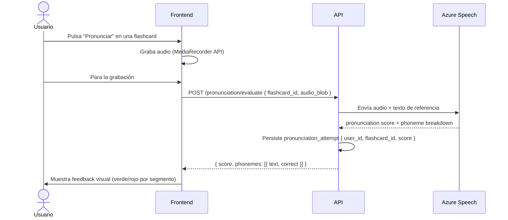

# User Profile & Pronunciation Bonus — Definición conceptual

---

## Perfil de usuario

| Campo                | Tipo           | Descripción                                          |
| -------------------- | -------------- | ---------------------------------------------------- |
| `id`                 | uuid           | Identificador interno                                |
| `email`              | string         | Email (obligatorio)                                  |
| `password_hash`      | string \| null | null si es OAuth                                     |
| `nickname`           | string         | Nombre público en rankings                           |
| `avatar_url`         | string \| null | URL del avatar (subido o generado)                   |
| `show_in_ranking`    | boolean        | Opt-in para aparecer en rankings (default: false)    |
| `oauth_provider`     | enum \| null   | `google` \| null                                     |
| `role`               | enum           | `user` \| `teacher` \| `admin` \| `premium` (futuro) |
| `current_streak`     | integer        | Días consecutivos de actividad                       |
| `longest_streak`     | integer        | Máxima racha histórica                               |
| `last_activity_date` | date           | Último día con actividad (juego o estudio)           |
| `push_subscription`  | jsonb \| null  | Datos de suscripción push (VAPID)                    |
| `created_at`         | timestamp      | —                                                    |

---

## Pronunciación Bonus

### Qué es

Al responder una flashcard en **modo juego**, el usuario tiene la opción de pronunciar la `expression` en voz alta. Azure Speech Service evalúa la pronunciación y devuelve feedback visual.

- Es **completamente opcional** — no es obligatorio para completar la flashcard.
- Solo aplica a la `expression`, no a los ejemplos.
- Disponible en **modo juego** únicamente (no en estudio).

### Output visual

- 🟢 Verde — sonidos pronunciados correctamente
- 🔴 Rojo — sonidos con errores

El feedback es **por fonema / segmento** — no un simple pass/fail. El usuario ve exactamente qué parte sonó mal.

### Puntuación

- El resultado de pronunciación es una **métrica separada** del accuracy de flashcards.
- No contamina el accuracy rate del ranking (que solo mide ✓/✗ de la auto-evaluación).
- Genera su propia métrica: `pronunciation_score` (0-100) por flashcard y agregado por módulo.
- **No afecta al ranking en MVP** — se muestra como estadística personal únicamente.
- Documentado para incluir en ranking post-MVP (cuando se añada el tier Premium).

### Monetización futura

La evaluación de pronunciación será una funcionalidad **Premium** una vez se implemente la monetización. En MVP es gratuita para todos los usuarios registrados.

### Diagrama de secuencia

