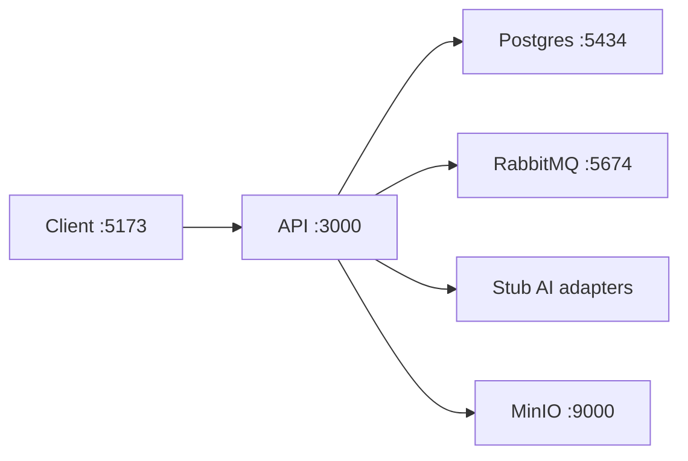

# Local Development Profile

Perfil **autocontenido** para ejecutar ididntcatchthat sin Doppler, sin Aiven, sin Cloudflare R2 ni APIs de pago (ElevenLabs, DeepSeek).

Pensado para evaluación del TFM, onboarding de revisores y desarrollo offline.

---

## Quick start

```bash
pnpm install
make local-setup
make local-up
make local-seed
make local-dev
```

Abre http://localhost:5173

---

## Qué incluye

| Componente | Local | Dev (Doppler) |
|------------|-------|-----------------|
| Secrets | `.env.local` (gitignored) | Doppler `dev` |
| PostgreSQL | Docker `:5434` | Aiven dev |
| RabbitMQ | Docker `:5674` | Docker / remoto |
| Object storage | MinIO `:9000` (S3-compatible) | Cloudflare R2 |
| ElevenLabs / DeepSeek | Stubs (`USE_STUB_ADAPTERS=true`) | APIs reales |
| Google OAuth | Dummy (no funciona) | OAuth real |

---

## Comandos Make

| Comando | Descripción |
|---------|-------------|
| `make local-setup` | Copia `apps/api/.env.local.example` y `apps/client/.env.local.example` → `.env.local` |
| `make local-up` | Levanta `docker-compose.local.yml` |
| `make local-down` | Para infra local |
| `make local-seed` | Migraciones + seed demo (idempotente) |
| `make local-dev` | Infra + API + Client en paralelo |
| `make local-dev-api` | Solo API |
| `make local-dev-client` | Solo Client |

Equivalente sin Make:

```bash
docker compose -f docker-compose.local.yml up -d --wait
cp apps/api/.env.local.example apps/api/.env.local
cp apps/client/.env.local.example apps/client/.env.local
pnpm --filter @ididntcatchthat/api seed:local
pnpm --filter @ididntcatchthat/api start:dev
pnpm --filter @ididntcatchthat/client dev
```

---

## Credenciales demo

Tras `make local-seed`:

| Campo | Valor |
|-------|-------|
| Email | `demo@local.dev` |
| Password | `DemoLocal123!` |
| Rol | `admin` (backoffice) |

También puedes jugar como **guest** sin registrarte.

---

## Puertos

| Servicio | Puerto host |
|----------|-------------|
| API | 3000 |
| Client (Vite) | 5173 |
| PostgreSQL | 5434 |
| RabbitMQ AMQP | 5674 |
| RabbitMQ UI | 15674 |
| MinIO API | 9000 |
| MinIO Console | 9001 |

MinIO console: usuario `localminio`, password `localminio`.

---

## Variables de entorno

Plantillas commiteadas (copiar a `.env.local`):

- [`apps/api/.env.local.example`](../apps/api/.env.local.example)
- [`apps/client/.env.local.example`](../apps/client/.env.local.example)

Flag principal:

```bash
USE_STUB_ADAPTERS=true
```

Cuando está activo, la API usa stubs para DeepSeek (generación de borradores y sugerencia de ejemplos), ElevenLabs y almacenamiento local. El almacenamiento de audio sigue usando `R2AudioStorage` apuntando a MinIO.

---

## Arquitectura



---

## Seed

El seed inserta:

- 1 usuario admin demo
- 20 flashcards repartidas en 4 módulos (`audio_status = ready`)

Es **idempotente**: si `demo@local.dev` ya existe, no duplica datos.

Script: `pnpm --filter @ididntcatchthat/api seed:local`

---

## Limitaciones conocidas

1. **Google OAuth** — requiere credenciales reales; en local usa email/password o guest.
2. **Audio de flashcards seed** — URLs de demo públicas (requieren internet para reproducir).
3. **Nuevos audios generados** — suben a MinIO local; el bucket debe existir (`minio-init` lo crea).
4. **Demo completa** — para experiencia 100% producción, usar [ididntcatchthat.com](https://ididntcatchthat.com).

---

## Troubleshooting

### Puerto ocupado

Comprueba que `:5434`, `:5674`, `:9000` estén libres. El perfil E2E usa `:5433` y `:5673` — no deberían conflictuar.

### Seed falla con "connection refused"

```bash
make local-up
docker compose -f docker-compose.local.yml ps
```

Espera a que Postgres esté healthy antes de `make local-seed`.

### MinIO bucket no existe

```bash
docker compose -f docker-compose.local.yml logs minio-init
docker compose -f docker-compose.local.yml up minio-init
```

### API no carga `.env.local`

Ejecuta comandos desde la raíz con `pnpm --filter` o desde `apps/api/` donde existe el archivo `.env.local`.

---

## Ver también

- [ADR-016: Estrategia de entornos](./adr/016-environments-strategy.md)
- [ADR-017: Secrets con Doppler](./adr/017-secrets-doppler.md) — flujo del desarrollador principal
