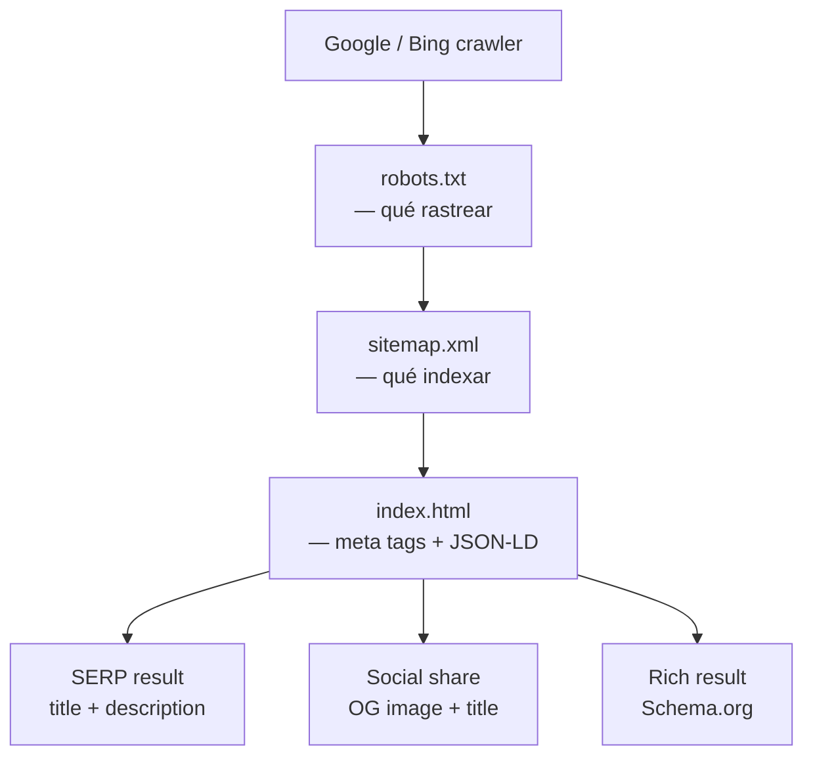

# SEO — ididntcatchthat

Referencia de la implementación SEO del cliente React. Explica qué hay, por qué está ahí y cómo mantenerlo.

---

## Ficheros involucrados

| Fichero | Rol |
|---|---|
| `apps/client/index.html` | Meta tags, Open Graph, Twitter Card, JSON-LD |
| `apps/client/public/robots.txt` | Directivas para crawlers |
| `apps/client/public/sitemap.xml` | Mapa de URLs indexables |

---

## `index.html` — qué contiene y por qué

### 1. Primary SEO

```html
<title>ididntcatchthat — English pronunciation for real conversations</title>
<meta name="description" content="Learn the English you actually hear. Real connected speech, native expressions, and phonetics — gamified." />
<meta name="keywords" content="english pronunciation, connected speech, phonetics, language learning, ESL, listening skills" />
<meta name="author" content="ididntcatchthat" />
<meta name="robots" content="index, follow" />
<link rel="canonical" href="https://ididntcatchthat.com/" />
```

| Tag | Por qué importa |
|---|---|
| `<title>` | El texto que Google muestra en los resultados. Límite recomendado: 60 caracteres. |
| `description` | El snippet bajo el título en resultados. Google puede ignorarla pero es el punto de partida. Límite: 155 caracteres. |
| `keywords` | Ignorada por Google, útil para otros motores y para documentar intención. |
| `robots` | Indica explícitamente que la página debe indexarse y que se sigan los enlaces. |
| `canonical` | Evita contenido duplicado cuando la misma página se sirve desde varias URLs (www vs no-www, http vs https). |

### 2. Open Graph

```html
<meta property="og:type"        content="website" />
<meta property="og:site_name"   content="ididntcatchthat" />
<meta property="og:title"       content="ididntcatchthat — English pronunciation for real conversations" />
<meta property="og:description" content="Learn the English you actually hear. Real connected speech, native expressions, and phonetics — gamified." />
<meta property="og:url"         content="https://ididntcatchthat.com/" />
<meta property="og:image"       content="https://ididntcatchthat.com/og-image.png" />
<meta property="og:image:width" content="1200" />
<meta property="og:image:height" content="1200" />
<meta property="og:image:alt"   content="ididntcatchthat — English pronunciation platform" />
<meta property="og:locale"      content="en_US" />
```

Open Graph controla cómo aparece la web al compartirse en Facebook, LinkedIn y WhatsApp.

**Requisitos de `og:image`:**
- Dimensiones mínimas: 1200 × 630 px (ratio 1.91:1)
- Formato: PNG o JPG
- Tamaño máximo: 8 MB (recomendado < 1 MB)
- Fichero a crear: `apps/client/public/og-image.png` (pendiente — ver sección "Pendientes")

### 3. Twitter / X Card

```html
<meta name="twitter:card"        content="summary_large_image" />
<meta name="twitter:site"        content="@ididntcatchthat" />
<meta name="twitter:title"       content="ididntcatchthat — English pronunciation for real conversations" />
<meta name="twitter:description" content="Learn the English you actually hear. Real connected speech, native expressions, and phonetics — gamified." />
<meta name="twitter:image"       content="https://ididntcatchthat.com/og-image.png" />
<meta name="twitter:image:alt"   content="ididntcatchthat — English pronunciation platform" />
```

`summary_large_image` muestra una tarjeta con imagen grande al compartir en X/Twitter. Reutiliza la misma imagen que OG.

### 4. Structured Data — JSON-LD

```html
<script type="application/ld+json">
  {
    "@context": "https://schema.org",
    "@graph": [
      { "@type": "WebSite", ... },
      { "@type": "EducationalOrganization", ... },
      { "@type": "WebApplication", ... }
    ]
  }
</script>
```

Tres entidades Schema.org que Google lee para enriquecer los resultados:

| Tipo | Qué aporta |
|---|---|
| `WebSite` | Identifica el sitio. Habilita el `SearchAction` para el cuadro de búsqueda en resultados de Google cuando el sitio tenga suficiente autoridad. |
| `EducationalOrganization` | Categoriza la web como organización educativa. Puede aparecer en Knowledge Panel. |
| `WebApplication` | Señala que es una app web. Informa sobre la categoría (`EducationApplication`) y el precio (gratuito). |

**Validar con:** [Google Rich Results Test](https://search.google.com/test/rich-results) · [Schema.org Validator](https://validator.schema.org/)

---

## `robots.txt`

```
User-agent: *
Allow: /

Disallow: /app/
Disallow: /backoffice/
Disallow: /auth/callback
Disallow: /api/

Sitemap: https://ididntcatchthat.com/sitemap.xml
```

- Las rutas `/app/`, `/backoffice/`, `/auth/callback` y `/api/` son privadas — no tienen valor SEO y pueden exponer estructura interna a crawlers.
- La directiva `Sitemap:` apunta al sitemap para que los bots lo descubran automáticamente.

**Verificar con:** `curl https://ididntcatchthat.com/robots.txt`

---

## `sitemap.xml`

```xml
<urlset xmlns="http://www.sitemaps.org/schemas/sitemap/0.9">
  <url>
    <loc>https://ididntcatchthat.com/</loc>
    <lastmod>2026-06-28</lastmod>
    <changefreq>weekly</changefreq>
    <priority>1.0</priority>
  </url>
  <url>
    <loc>https://ididntcatchthat.com/auth/login</loc>
    <lastmod>2026-06-28</lastmod>
    <changefreq>monthly</changefreq>
    <priority>0.6</priority>
  </url>
  <url>
    <loc>https://ididntcatchthat.com/auth/register</loc>
    <lastmod>2026-06-28</lastmod>
    <changefreq>monthly</changefreq>
    <priority>0.6</priority>
  </url>
</urlset>
```

Solo se indexan las rutas públicas. Las rutas de la app autenticada (`/app/*`, `/backoffice/*`) no aparecen en el sitemap.

**Enviar a Google Search Console:** Settings → Sitemaps → `https://ididntcatchthat.com/sitemap.xml`

**Actualizar `lastmod`** al desplegar cambios significativos en una URL.

---

## Flujo de crawling



---

## Limitaciones actuales (SPA)

ididntcatchthat es una **Single Page Application** (React + Vite). Los bots de Google ejecutan JavaScript, por lo que el contenido renderizado en cliente sí se indexa en la mayoría de casos. Sin embargo:

- Las rutas dinámicas (`/app/session/:id`, etc.) no tienen meta tags propias — solo hereda los tags del `index.html` raíz.
- Bing y otros motores menores pueden no ejecutar JS correctamente.
- Las rutas de la app autenticada están bloqueadas en `robots.txt` igualmente.

**Si en el futuro se añaden rutas públicas con contenido dinámico** (ej. landing de un módulo fonético específico), considerar SSR con un servidor intermedio o pre-rendering estático para esas rutas.

---

## Pendientes

| Tarea | Prioridad | Notas |
|---|---|---|
| Crear `og-image.png` (1200×630) | Alta | Los tags OG y Twitter ya están — solo falta el asset en `public/` |
| Registrar en Google Search Console | Alta | Enviar sitemap, verificar cobertura de indexación |
| Añadir `lastmod` dinámico al sitemap | Media | Puede generarse en el pipeline de build con la fecha del último commit |
| Meta tags por ruta en rutas públicas futuras | Media | Usar `react-helmet-async` o equivalente si se añaden rutas con contenido indexable |
| Verificar JSON-LD con Rich Results Test | Alta | Hacerlo una vez desplegado en producción |

---

*Implementado en la rama `feat/branding-seo-accessibility` — junio 2026*
