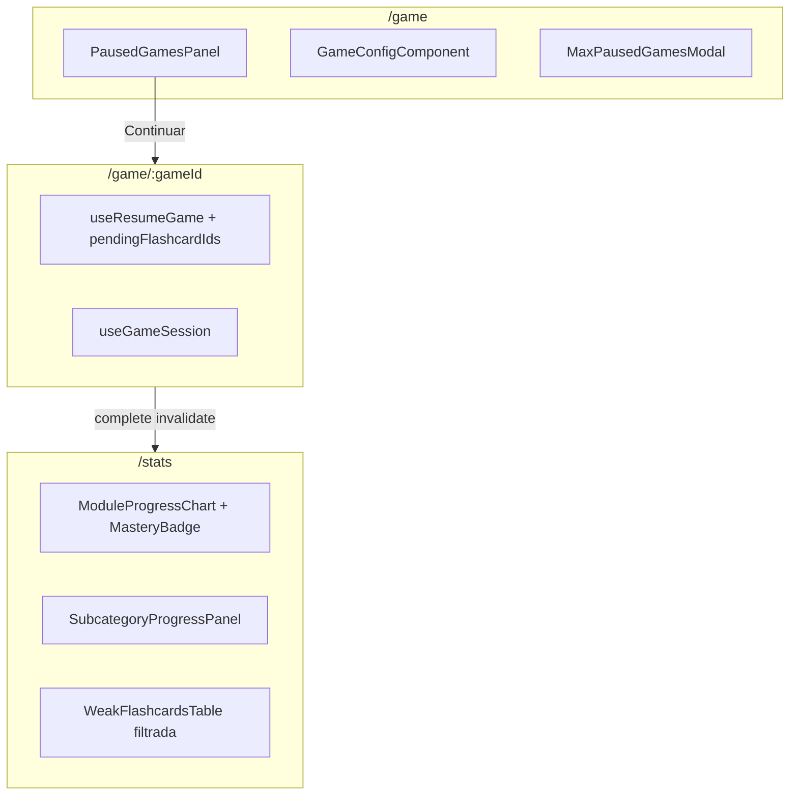

# Spec: Game & Stats UX — Pausa, retoma y progreso

> Plan de implementación acordado (single PR). Complementa [gaming-client.md](./gaming-client.md) y [progress.md](./progress.md).
> Referencia de dominio: [game-mechanics.md](../domain/game-mechanics.md).

## Objetivo

Cerrar los huecos de producto en `/game` (pausar/retomar, límite de 5, resiliencia de sesión) y renovar `/stats` (datos correctos, frescura, drill-down coherente, mastery, CTAs de práctica), con polish de `GameComponent` según spec.

## Estado actual vs objetivo

| Área | Backend | Cliente (antes) | Cliente (objetivo) |
|------|---------|-----------------|-------------------|
| Pausar partida | `PATCH /games/:id` | Botón → `/game` sin retomar | Panel partidas en curso |
| Listar pausadas | `GET /games` | Sin UI | `PausedGamesPanel` |
| Retomar | `GET /games/:id/resume` | Hook sin usar | Flujo resume en `GameContainer` |
| Límite 5 pausadas | `409 MaxPausedGamesReached` | Sin modal | `MaxPausedGamesModal` |
| Flashcards difíciles | SQL sin filtro errores | 0 errores visibles | `error_count > 0` |
| Stats post-partida | Eventos OK | Sin invalidación | Invalidar `statsKeys` al completar |

## Arquitectura



## Bloques de implementación

### A — Backend: weakest flashcards

- SQL: `AND (times_played - correct_count) > 0` en `typeorm-weakest-flashcard.query.ts`
- Tests + docs en `weakest-flashcards/usecases.md`

### B — Cliente API game

- `usePausedGames`, `useAbandonGame`, `PausedGameVM`
- Invalidación `gameKeys.paused` y `statsKeys.all` en mutations

### C — `/game` configuración

- `PausedGamesPanel`, `MaxPausedGamesModal`
- Deep link `{ prefillModule, prefillSubcategory }` desde stats
- Error UI guest auto-start

### D — `/game/:gameId` sesión

- Eliminar guardia `flashcardIds` obligatorio
- Modos: nueva partida | `state.mode === 'resume'` | resume fallback
- Toast al pausar

### E — GameComponent polish

- i18n pause/audio, IPA en dorso, nativeSpeech, mic bloqueado

### F — `/stats`

- Skeletons por sección, invalidación post-partida
- `MasteryBadge` (levels 0–3), URL `?category=`, tabla débiles filtrada
- CTA Practicar → `/game`, empty states, i18n

### G — Resumen

- Link a partidas pausadas en `GameSummaryContainer`

## Criterios de aceptación

**Game**

- Pausar → `/game` lista la partida en “Partidas en curso”
- Continuar → retoma cartas pendientes
- 5 pausadas → modal abandonar + nueva partida
- Refresh en `/game/:id` no expulsa al usuario
- Guest: sin pausar ni panel pausadas

**Stats**

- Post-partida sin refresh manual
- “Más difíciles” sin 0 errores
- Drill-down + URL + tabla filtrada + mastery + CTA practicar

## Decisiones

- Repeat-wrong no aplica al retomar pausada
- `module === null` → label “Aleatorio” en panel pausadas
- 409 modal usa `GET /games` (lista real), no parsear error body

## Bloque I — Layout responsive desktop (`/game`)

> Objetivo: la experiencia mobile-first se mantiene en móvil; en `lg+` (≥1024px) el flujo aprovecha el ancho sin romper el foco de una carta a la vez.

### Principios

| Pantalla | Mobile / tablet | Desktop (`lg+`) |
|----------|-----------------|-----------------|
| Shell | `GameShell` sin sidebar (foco) | Igual — no sidebar en partida activa |
| Config | Columna única centrada | 2 columnas: pausadas sticky \| formulario ancho |
| Partida | Carta ~420px, controles apilados | Carta hasta ~672px + panel lateral de progreso/atajos |
| Resumen | Grid 2×2 stats | Grid 4 columnas stats + CTAs en grid |

### Breakpoints (Tailwind)

- **`sm` (640px):** módulos 2 cols; subcategorías 2 cols
- **`md` (768px):** caps de ancho suben (`max-w-xl`); subcategorías sin scroll forzado
- **`lg` (1024px):** layout de 2 columnas en config; sidebar en partida; stats 4 cols

### `/game` — Configuración

```
Mobile                    Desktop (lg+)
┌──────────────┐         ┌──────────┬─────────────────────┐
│ Pausadas     │         │ Pausadas │ Título + formulario │
│ (stack)      │         │ sticky   │ módulos 3 cols      │
│ Módulos      │         │ 320px    │ subcats 3 cols      │
│ Subcats      │         │          │ CTA full width col  │
│ CTA          │         └──────────┴─────────────────────┘
└──────────────┘
```

- `PausedGamesPanel` en `<aside>` sticky (`top-20`) cuando hay partidas pausadas
- Formulario: `max-w-md` → `max-w-2xl` cuando no hay panel; `max-w-5xl` grid cuando sí hay
- Subcategorías: `max-h-48` solo en mobile; grid 2–3 cols en `md+`

### `/game/:id` — Partida

```
Mobile                    Desktop (lg+)
┌──────────────┐         ┌────────────────────┬──────────┐
│ progress     │         │ progress           │ Progreso │
│ carta 420px  │         │ carta hasta 672px  │ Atajos   │
│ ✓/✗          │         │ ✓/✗                │ teclado  │
│ mic (hidden  │         │                    │          │
│  lg:hidden)  │         └────────────────────┴──────────┘
└──────────────┘
```

- Carta: `max-w-[420px] md:max-w-xl lg:max-w-2xl`, altura `300→360→420px`
- `GamePlaySidebar`: progreso numérico + barra + atajos (`Space`, `←`, `→`, `P`)
- Hint flip: `tapToReveal` en touch; `hoverToReveal` con `(hover: hover) and (pointer: fine)`
- Atajos globales vía `useGameKeyboardShortcuts` en `GameContainer`

### `/game/:id/summary` — Resumen

- Contenedor: `max-w-sm` → `md:max-w-xl lg:max-w-3xl`
- Stats: `grid-cols-2 md:grid-cols-4`
- CTAs logged: grid 2 cols en `lg`; link pausadas span 2 cols

### Criterios de aceptación (responsive)

- [ ] En viewport ≥1024px, config con pausadas muestra panel lateral sticky
- [ ] Sin partidas pausadas, config centrada en una sola columna (no grid vacío)
- [ ] Carta de partida ocupa más ancho/alto que en mobile
- [ ] Sidebar de atajos visible solo en `lg+`
- [ ] Space voltea; flechas responden solo con carta volteada
- [ ] Resumen muestra 4 métricas en fila en desktop
- [ ] Mobile sin regresiones (single column, tap hints)

### Fuera de alcance (follow-up)

- `/game` config dentro de `AppShell` (sidebar global de app)
- Flip automático on hover (solo hint de texto)
- `FlashcardBoard` refactor completo
- Capa visual arcade (glows, shimmer, pseudo-HUD) — descartada por sensación artificial; priorizar polish sutil sobre tokens existentes
