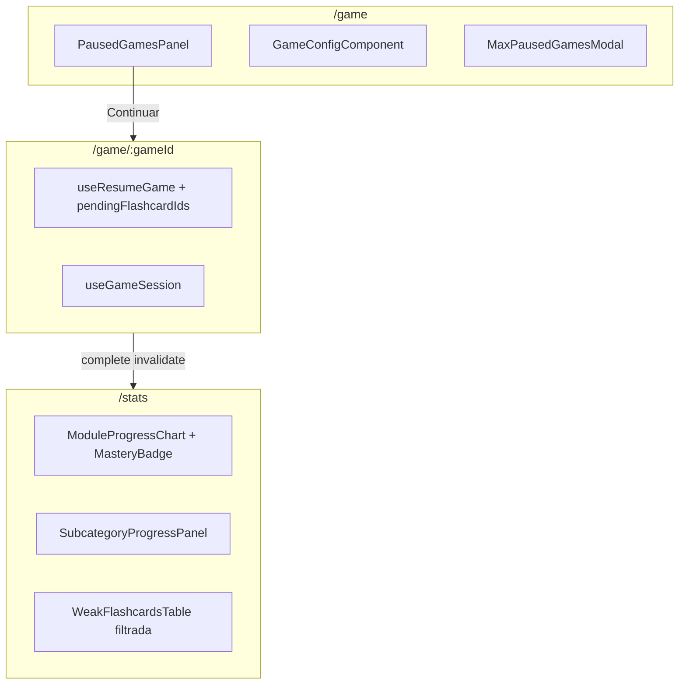

# Spec: Game & Stats UX — Pausa, retoma y progreso

> Plan de implementación acordado (single PR). Complementa [gaming-client.md](./gaming-client.md) y [progress.md](./progress.md).
> Referencia de dominio: [game-mechanics.md](../domain/game-mechanics.md).

## Objetivo

Cerrar los huecos de producto en `/game` (pausar/retomar, límite de 5, resiliencia de sesión) y renovar `/stats` (datos correctos, frescura, drill-down coherente, mastery, CTAs de práctica), con polish de `GameComponent` según spec.

## Estado actual vs objetivo

| Área | Backend | Cliente (antes) | Cliente (objetivo) |
|------|---------|-----------------|-------------------|
| Pausar partida | `PATCH /games/:id` | Botón → `/game` sin retomar | Panel partidas en curso |
| Listar pausadas | `GET /games` | Sin UI | `PausedGamesPanel` |
| Retomar | `GET /games/:id/resume` | Hook sin usar | Flujo resume en `GameContainer` |
| Límite 5 pausadas | `409 MaxPausedGamesReached` | Sin modal | `MaxPausedGamesModal` |
| Flashcards difíciles | SQL sin filtro errores | 0 errores visibles | `error_count > 0` |
| Stats post-partida | Eventos OK | Sin invalidación | Invalidar `statsKeys` al completar |

## Arquitectura

## Bloques de implementación

### A — Backend: weakest flashcards

- SQL: `AND (times_played - correct_count) > 0` en `typeorm-weakest-flashcard.query.ts`
- Tests + docs en `weakest-flashcards/usecases.md`

### B — Cliente API game

- `usePausedGames`, `useAbandonGame`, `PausedGameVM`
- Invalidación `gameKeys.paused` y `statsKeys.all` en mutations

### C — `/game` configuración

- `PausedGamesPanel`, `MaxPausedGamesModal`
- Deep link `{ prefillModule, prefillSubcategory }` desde stats
- Error UI guest auto-start

### D — `/game/:gameId` sesión

- Eliminar guardia `flashcardIds` obligatorio
- Modos: nueva partida | `state.mode === 'resume'` | resume fallback
- Toast al pausar

### E — GameComponent polish

- i18n pause/audio, IPA en dorso, nativeSpeech, mic bloqueado

### F — `/stats`

- Skeletons por sección, invalidación post-partida
- `MasteryBadge` (levels 0–3), URL `?category=`, tabla débiles filtrada
- CTA Practicar → `/game`, empty states, i18n

### G — Resumen

- Link a partidas pausadas en `GameSummaryContainer`

## Criterios de aceptación

**Game**

- Pausar → `/game` lista la partida en “Partidas en curso”
- Continuar → retoma cartas pendientes
- 5 pausadas → modal abandonar + nueva partida
- Refresh en `/game/:id` no expulsa al usuario
- Guest: sin pausar ni panel pausadas

**Stats**

- Post-partida sin refresh manual
- “Más difíciles” sin 0 errores
- Drill-down + URL + tabla filtrada + mastery + CTA practicar

## Decisiones

- Repeat-wrong no aplica al retomar pausada
- `module === null` → label “Aleatorio” en panel pausadas
- 409 modal usa `GET /games` (lista real), no parsear error body
