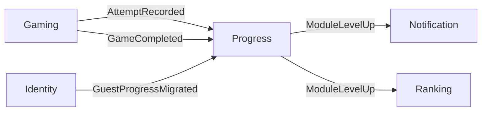

# Spec: Progress — Bounded Context Progress

**Estado**: Implementado  
**Fecha**: 2026-05-27 (actualizado 2026-06-27 — Progress UX v2)  
**BC**: Progress  
**Scope**: API (`apps/api/src/progress/`)  
**Tasks**: [docs/tasks/progress.md](../tasks/progress.md), [docs/tasks/progress-ux-v2.md](../tasks/progress-ux-v2.md)  
**Spec v2**: [docs/spec/progress-ux-v2.md](../spec/progress-ux-v2.md)

---

## Responsabilidad del BC

Progress materializa el historial de aprendizaje del usuario. Recibe eventos de Gaming e Identity vía AMQP y expone read models para la UI (módulos dominados, flashcards débiles).

**No** guarda estado de partidas activas — eso es Gaming. **No** calcula rankings — eso es Ranking.

---

## Casos de uso por actor

| Actor | Caso de uso                | Endpoint                           |
| ----- | -------------------------- | ---------------------------------- |
| User  | Ver progreso por módulo    | `GET /progress/modules`            |
| User  | Ver progreso por subcategoría | `GET /progress/subcategories`   |
| User  | Ver resumen hero KPI       | `GET /progress/summary`            |
| User  | Ver flashcards más débiles | `GET /progress/flashcards/weakest` |

> Ambos endpoints requieren usuario autenticado. No existen equivalentes para guests — el progreso guest no se persiste en este BC.

---

## Eventos consumidos

| Exchange | BC Emisor | Handler | Idempotencia |
| -------- | --------- | ------- | ------------ |
| `ididntcatchthat.gaming.attempts.attempt.recorded` | Gaming | `FlashcardStatsUpdaterOnAttemptRecorded` | Natural — UPSERT por `(userId, flashcardId)` |
| `ididntcatchthat.gaming.views.flashcard.viewed` | Gaming | `FlashcardStatsUpdaterOnFlashcardViewed` | Natural — UPSERT por `(userId, flashcardId)` |
| `ididntcatchthat.gaming.games.game.completed` | Gaming | `ModuleProgressUpdaterOnGameCompleted` | Natural — recálculo idempotente |
| `ididntcatchthat.identity.user.guest_progress_migrated` | Identity | `GuestProgressImporterOnGuestProgressMigrated` | Inbox table — `processed_events` |

### Reglas de procesamiento

- `AttemptRecorded` con `userId = null` → **ignorar** (guest — sin progreso persistido).
- `AttemptRecorded` con `mode = study` → incrementa `times_studied`. Con `mode = game` → incrementa `times_played`.
- `AttemptRecorded` con `mode = game` y partida random (`games.module IS NULL`) → tras actualizar stats, recalcula `ModuleProgress` del módulo de la flashcard (`flashcards.category`).
- `GameCompleted` con `module` definido → recalcula `ModuleProgress` de ese módulo (comportamiento existente).
- `GameCompleted` con `module = null` (random) → recalcula `ModuleProgress` de **cada módulo** tocado en la partida (distinct categories de attempts **y** `game_views`).
- `GuestProgressMigrated` → bulk UPSERT de `user_flashcard_stats` para el `userId` recién registrado, a partir de los attempts del `guestDeviceId`.

---

## Eventos publicados

| Exchange | Cuándo |
| -------- | ------ |
| `idct.progress.module_progress.module_mastery_level.increased` | Cuando `masteryLevel` sube — `ModuleProgress.record()` |

---

## Modelo de datos

### Tabla `user_flashcard_stats` (ya en db-schema.md)

PK compuesta: `(user_id, flashcard_id)`.

| Columna         | Tipo        | Notas                               |
| --------------- | ----------- | ----------------------------------- |
| `user_id`       | `uuid FK`   |                                     |
| `flashcard_id`  | `uuid FK`   |                                     |
| `times_studied` | `int`       | Increments en modo `study`          |
| `times_played`  | `int`       | Increments en modo `game`           |
| `correct_count` | `int`       |                                     |
| `accuracy_rate` | `decimal`   | `correct_count / times_played`, 0–1 |
| `last_seen_at`  | `timestamp` |                                     |

### Tabla `module_progress` (nueva)

Read model materializado. Se recalcula cada vez que llega `GameCompleted` con módulo definido.

| Columna          | Tipo        | Notas                                                                           |
| ---------------- | ----------- | ------------------------------------------------------------------------------- |
| `user_id`        | `uuid FK`   |                                                                                 |
| `module`         | `varchar`   | `native_sounds \| connected_speech \| flow_connectors \| real_talk` |
| `total_attempts` | `int`       | Total de attempts del usuario en este módulo                                    |
| `correct_count`  | `int`       |                                                                                 |
| `accuracy`       | `decimal`   | 0–1                                                                             |
| `mastery_level`  | `int`       | 0–3 (ver fórmula más abajo)                                                     |
| `last_played_at` | `timestamp` |                                                                                 |
| `updated_at`     | `timestamp` |                                                                                 |

PK compuesta: `(user_id, module)`.

### Tabla `processed_events` (Inbox — nueva)

Usada solo por el handler `import_guest_progress_on_guest_progress_migrated`.

| Columna        | Tipo        | Notas                  |
| -------------- | ----------- | ---------------------- |
| `event_id`     | `uuid PK`   | ID del evento recibido |
| `handler`      | `varchar`   | Nombre del handler     |
| `processed_at` | `timestamp` |                        |

---

## Fórmula de `masteryLevel`

Basada en attempts totales del módulo (suma de todos los games de ese módulo) y accuracy global del módulo.

| Nivel | Condición                                   |
| ----- | ------------------------------------------- |
| 0     | `total_attempts < 5`                        |
| 1     | `total_attempts >= 5` y `accuracy >= 0.50`  |
| 2     | `total_attempts >= 10` y `accuracy >= 0.70` |
| 3     | `total_attempts >= 20` y `accuracy >= 0.85` |

> `studyLevel` y `studyCoverage` se calculan por módulo desde `times_studied` (ver [study.md](./study.md)). `combinedLevel` fuera de scope MVP.

Cuando `masteryLevel` sube (comparar valor anterior con nuevo), publicar `ModuleLevelUpEvent`.

---

## Modelo de dominio

### Value Objects

```
StringValueObject (shared)
  ├── ProgressUserId    — UUID v4
  ├── ProgressFlashcardId — UUID v4
  └── ModuleName        — enum: native_sounds | connected_speech | flow_connectors | real_talk
```

> `ProgressUserId` y `ProgressFlashcardId` son wrappers locales para no acoplar al BC Identity/Content.

### Aggregate `UserFlashcardStats`

```
UserFlashcardStats extends AggregateRoot<UserFlashcardStatsPrimitives>
  ├── userId: ProgressUserId
  ├── flashcardId: ProgressFlashcardId
  ├── timesStudied: number
  ├── timesPlayed: number
  ├── correctCount: number
  ├── accuracyRate: number           — calculado en write-time
  └── lastSeenAt: Date

  + recordStudy(correct: boolean): void
  + recordPlay(correct: boolean): void
  + fromPrimitives(p): UserFlashcardStats  [static]
  + toPrimitives(): UserFlashcardStatsPrimitives
```

### Read Model `ModuleProgress`

No es un aggregate — es un read model recalculado en su totalidad cada vez que llega `GameCompleted`.

```
ModuleProgress
  ├── userId: string
  ├── module: ModuleName
  ├── totalAttempts: number
  ├── correctCount: number
  ├── accuracy: number
  ├── masteryLevel: number           — 0 | 1 | 2 | 3
  └── lastPlayedAt: Date

  + computeMasteryLevel(totalAttempts, accuracy): number  [static]
```

### Domain Event publicado

```
ModuleLevelUpEvent
  eventName: 'idct.progress.module_progress.module_mastery_level.increased'
  attrs:
    userId: string
    module: string
    previousLevel: number
    newLevel: number
    occurredAt: string
```

### Domain Exceptions

```
ModuleNameInvalid
  — cuando el slug de módulo no pertenece a LEARNING_MODULES
```

### Repository Interface

```
UserFlashcardStatsRepository  (token: USER_FLASHCARD_STATS_REPOSITORY)
  + save(stats: UserFlashcardStats): Promise<void>
  + search(userId: string, flashcardId: string): Promise<UserFlashcardStats | null>
  + findWeakest(userId: string, limit: number): Promise<UserFlashcardStats[]>
  + findByModule(userId: string, module: string): Promise<UserFlashcardStats[]>
```

```
ModuleProgressRepository  (token: MODULE_PROGRESS_REPOSITORY)
  + save(mp: ModuleProgress): Promise<void>
  + findAll(userId: string): Promise<ModuleProgress[]>
  + findByModule(userId: string, module: string): Promise<ModuleProgress | null>
```

---

## Application Layer

### Use Cases (query)

#### `GetModulesProgressUseCase`

- Input: `{ userId: string }`
- Query: `SELECT * FROM module_progress WHERE user_id = $1 ORDER BY mastery_level DESC`
- Output: `ModuleProgressViewModel[]`

#### `GetWeakestFlashcardsUseCase`

- Input: `{ userId: string, limit: number = 10 }`
- Query: `SELECT * FROM user_flashcard_stats WHERE user_id = $1 ORDER BY accuracy_rate ASC LIMIT $2`
- Output: `WeakestFlashcardViewModel[]`

### Event Handlers (AMQP consumers)

#### `UpdateFlashcardStatsOnAttemptRecorded`

```
Queue: update_flashcard_stats_on_attempt_recorded
Exchange: idct.gaming.attempts.attempt.recorded
Idempotencia: natural (UPSERT por PK compuesta)

Flow:
  1. Si userId = null → skip
  2. UPSERT user_flashcard_stats(userId, flashcardId)
     - mode = study  → timesStudied++
     - mode = game   → timesPlayed++, recalcula accuracyRate
     - correct       → correctCount++
     - lastSeenAt = now
```

#### `UpdateModuleProgressOnGameCompleted`

```
Queue: update_module_progress_on_game_completed
Exchange: idct.gaming.games.game.completed
Idempotencia: natural (recálculo total es idempotente)

Flow:
  1. Si module = null → skip
  2. Leer todos los user_flashcard_stats del userId para flashcards de ese módulo
  3. Recalcular totalAttempts, correctCount, accuracy, masteryLevel
  4. Comparar masteryLevel anterior con nuevo
  5. UPSERT module_progress
  6. Si masteryLevel subió → publicar ModuleLevelUpEvent
```

#### `ImportGuestProgressOnGuestProgressMigrated`

```
Queue: import_guest_progress_on_guest_progress_migrated
Exchange: idct.identity.users.guest_progress.migrated
Idempotencia: Inbox table (processed_events keyed by eventId + handler)

Flow:
  1. Verificar processed_events — si ya procesado → skip
  2. Cargar attempts del guestDeviceId desde gaming.attempts JOIN games
  3. Bulk UPSERT user_flashcard_stats para el userId real
  4. Insertar en processed_events
```

---

## API Endpoints

### `GET /progress/modules`

**Auth**: JWT requerido  
**Response**: `200 OK`

```json
{
  "data": [
    {
      "module": "native_sounds",
      "totalAttempts": 45,
      "correctCount": 38,
      "accuracy": 0.84,
      "masteryLevel": 2,
      "lastPlayedAt": "2026-05-26T10:00:00Z"
    }
  ]
}
```

### `GET /progress/flashcards/weakest`

**Auth**: JWT requerido  
**Query params**: `limit` (optional, default 10, max 50)  
**Response**: `200 OK`

```json
{
  "data": [
    {
      "flashcardId": "uuid",
      "timesStudied": 2,
      "timesPlayed": 8,
      "correctCount": 2,
      "accuracyRate": 0.25,
      "lastSeenAt": "2026-05-20T08:00:00Z"
    }
  ]
}
```

---

## Relación con otros BCs



---

## Consideraciones de implementación

1. **`AmqpMessageBus` en SharedModule**: antes de implementar Progress, mover el bus al SharedModule para que todos los módulos lo consuman sin duplicar conexión. Gaming e Identity deben reemplazar `NoopDomainEventPublisher`.

2. **`ContentModule` como referencia**: sigue exactamente el mismo patrón — `AmqpMessageBus` + `HandlersBootstrapper` + array `HANDLERS`.

3. **Migración de datos**: las tablas `module_progress` y `processed_events` son nuevas. `user_flashcard_stats` ya existe en el schema pero puede estar vacía.

4. **`findByModule` en `UserFlashcardStatsRepository`**: necesita un JOIN con la tabla `flashcards` para filtrar por `category`. Esto implica que Progress tiene una referencia read-only al catálogo de Content.
