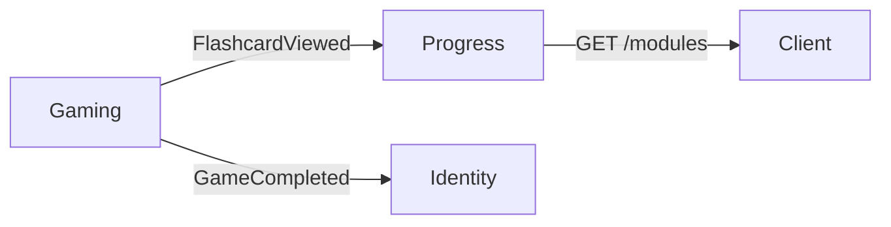

# Spec: Study Mode — API

**Estado**: Implementado  
**Fecha**: 2026-06-29  
**BC**: Gaming (sesión) + Progress (stats) + Identity (streak)  
**Tasks**: [docs/tasks/study.md](../tasks/study.md)  
**Cliente**: [docs/spec/study-client.md](./study-client.md)

---

## Responsabilidad

Permitir sesiones de repaso sin evaluación. Actualiza `times_studied`, racha diaria y Study Level por módulo. No afecta accuracy, ranking ni logros de juego.

---

## Endpoints

| Método | Ruta | Use case | Auth |
| ------ | ---- | -------- | ---- |
| `POST` | `/games` | `GameStarter` con `mode: study` | User (no guest) |
| `POST` | `/games/:id/views` | `ViewRecorder` | User |
| `POST` | `/games/:id/complete` | `GameCompleter` | User |
| `PATCH` | `/games/:id` | Pausar / abandonar | User |
| `GET` | `/games?status=paused` | Listar pausadas | User |
| `GET` | `/games/:id/resume` | Retomar | User |
| `GET` | `/games/:gameId/flashcards` | Flashcards de la sesión | Any |

> Reutiliza endpoints Gaming existentes. Solo `views` es nuevo.

---

## Reglas de negocio

| Regla | Detalle |
| ----- | ------- |
| Solo registrados | Guest + `mode: study` → `StudyRequiresAuth` (403) |
| Sin source weakest | `source: weakest` + study → `WeakestSourceRequiresGameMode` (422) |
| Views solo en study | `POST /views` en game mode → `ViewRequiresStudyMode` (409) |
| Attempts solo en game | `POST /attempts` en study mode → `AttemptRequiresGameMode` (409) |
| Sin accuracy | `recordStudy()` no incrementa `correctCount` ni `accuracyRate` |
| Streak | `GameCompletedEvent` dispara `StreakUpdater` igual que juego |
| Ranking | Ignora sesiones study (`mode !== 'game'`) |
| Logros | `first_game`, `perfect_session_10`, `weak_warrior` solo en `mode = game` |

---

## `POST /games/:id/views`

**Payload**:

```json
{ "flashcardId": "uuid" }
```

**Response**: `204 No Content`

**Evento**: `FlashcardViewedEvent`  
Exchange: `ididntcatchthat.gaming.views.flashcard.viewed`

Atributos: `gameId`, `userId`, `flashcardId`, `viewedAt`

---

## `POST /games/:id/complete` (study)

**Response** `200`:

```json
{
  "data": {
    "cardsViewed": 10,
    "totalCount": 10,
    "correctCount": 0,
    "accuracy": 0,
    "duration": 120
  }
}
```

---

## Study Level — `GET /progress/modules`

Campos añadidos por módulo:

| Campo | Tipo | Descripción |
| ----- | ---- | ----------- |
| `studyLevel` | `0–3` | Nivel derivado de cobertura |
| `studyCoverage` | `0–1` | % flashcards del módulo con `times_studied > 0` |

**Fórmula**:

```
coverage = flashcards_con_times_studied / flashcards_totales_módulo (audio ready)

Nivel 0: coverage < 0.25
Nivel 1: coverage >= 0.25
Nivel 2: coverage >= 0.50
Nivel 3: coverage >= 0.75
```

---

## Domain errors

| Clase | HTTP | Cuándo |
| ----- | ---- | ------ |
| `StudyRequiresAuth` | 403 | Guest inicia study |
| `ViewRequiresStudyMode` | 409 | View en game mode |
| `AttemptRequiresGameMode` | 409 | Attempt en study mode |
| `WeakestSourceRequiresGameMode` | 422 | source=weakest en study |

---

## Eventos


